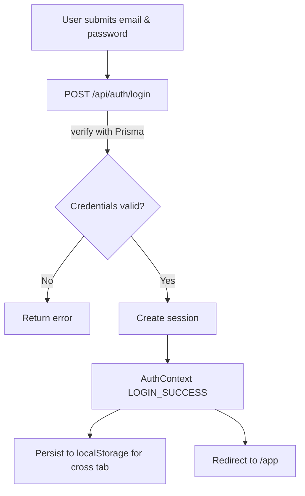
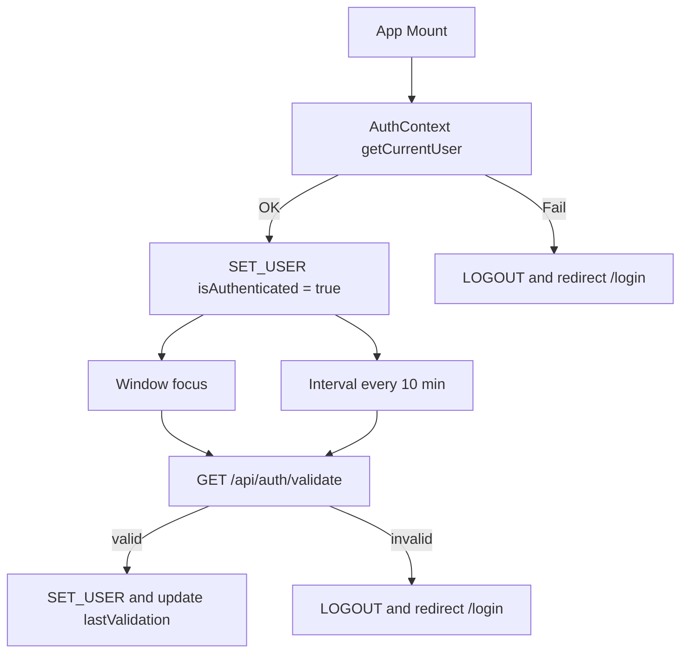
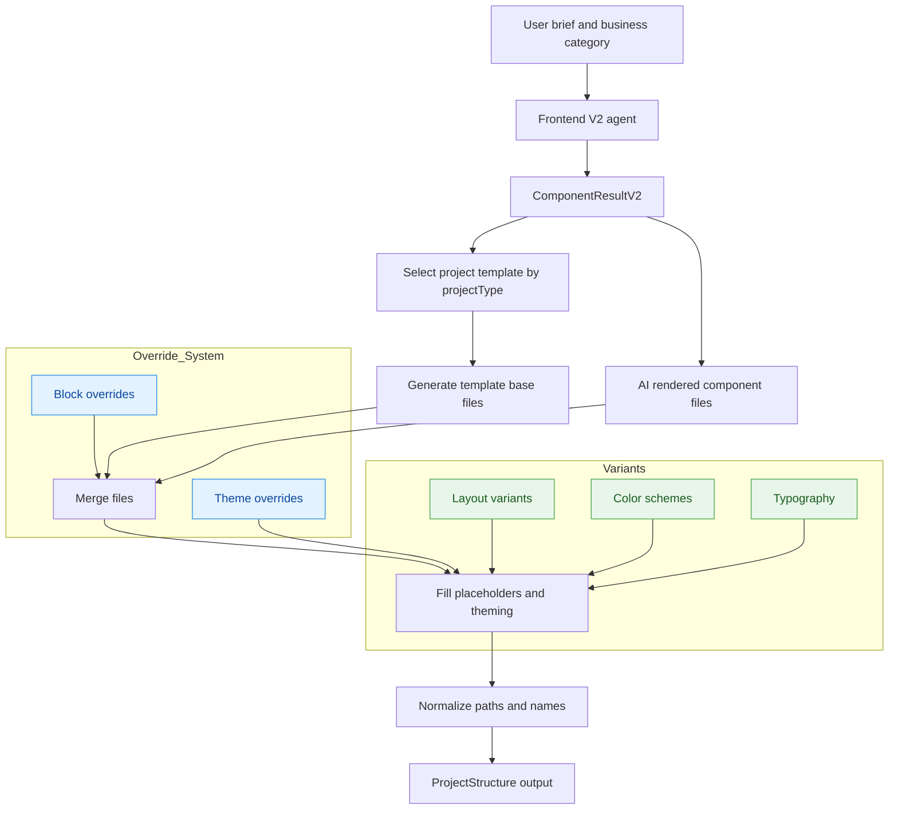
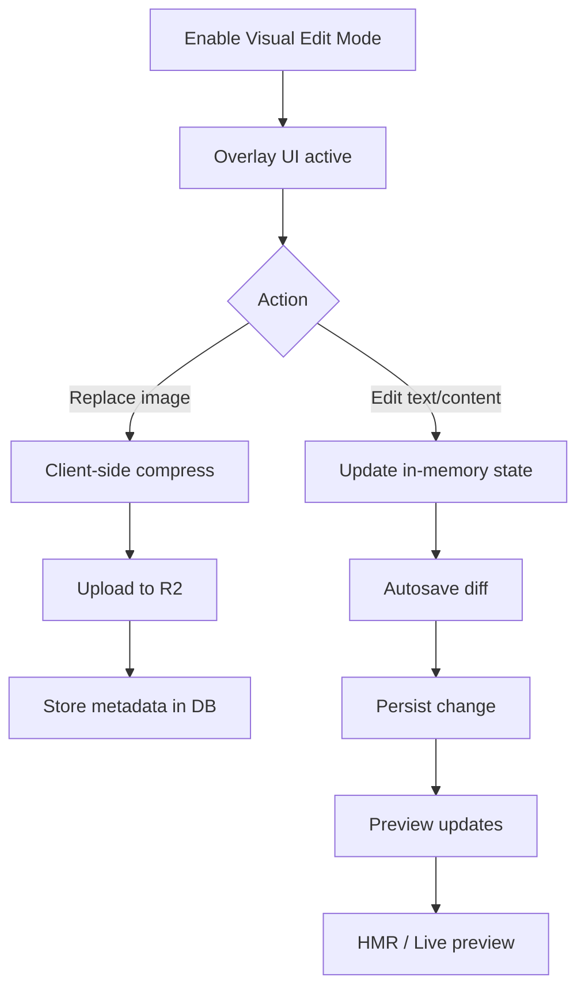
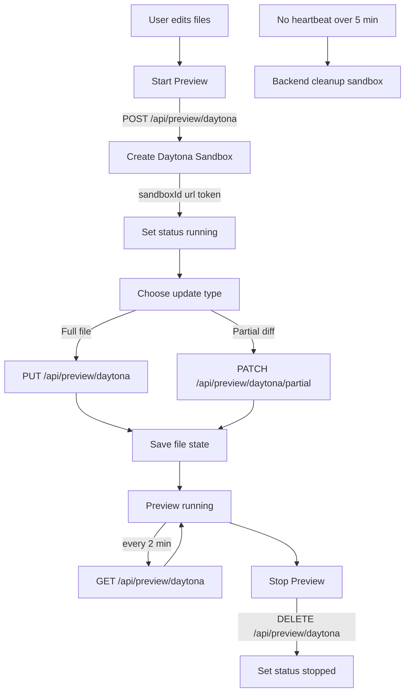
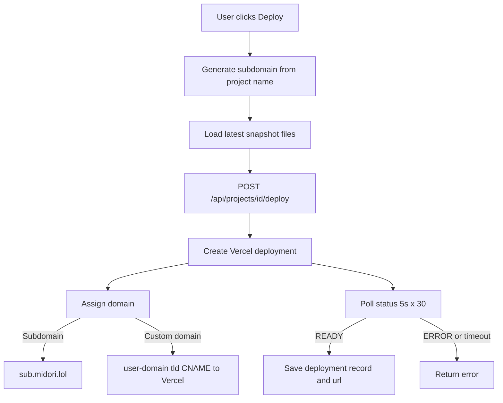
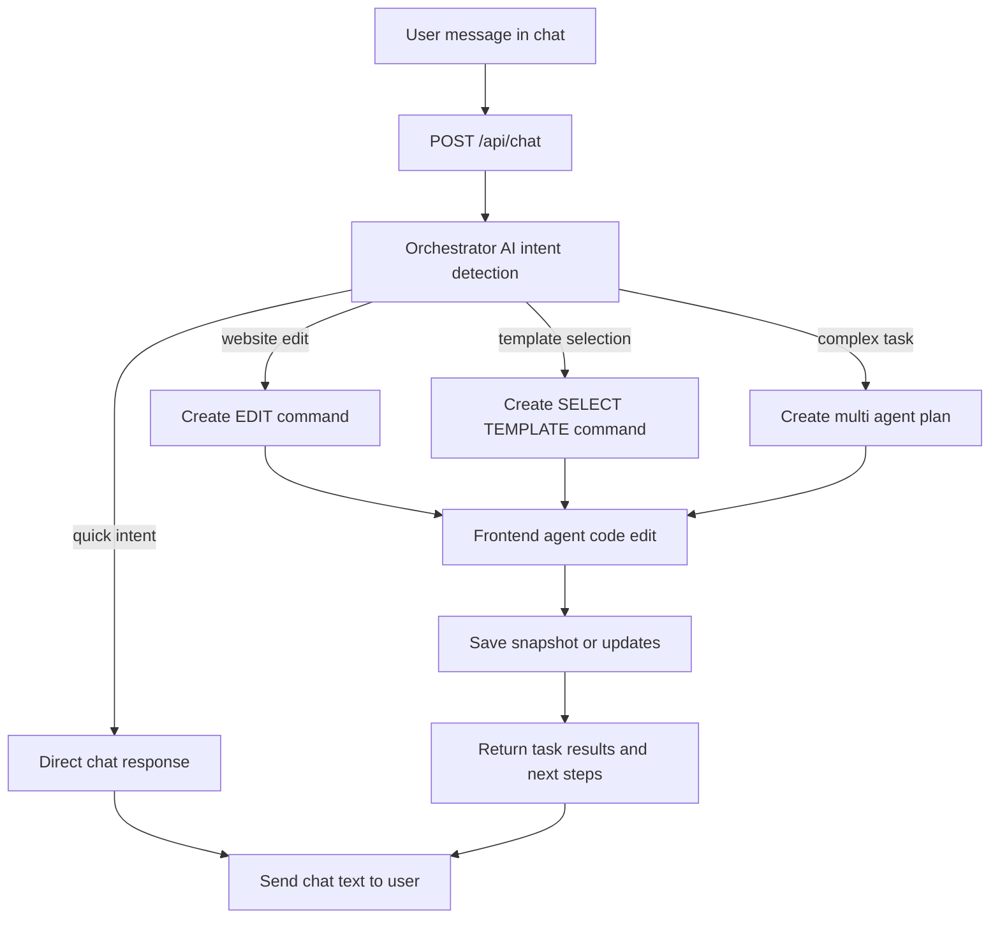

# 📘 เอกสารแนะนำโปรเจ็กต์ Midori

## 1. System Overview

### Architecture Diagram

Midori (Architecture)
├─ Next.js App Router Layer
│  ├─ src/app/
│  │  ├─ (app)/        # Protected routes
│  │  ├─ api/          # API endpoints
│  │  └─ home/         # Landing page components
│  └─ src/components/
│     ├─ projects/     # Project management UI
│     ├─ visual-edit/  # Visual edit mode
│     └─ common/       # Shared components
├─ Midori AI Core Layer
│  └─ src/midori/
│     ├─ agents/
│     │  ├─ orchestrator/   # Master coordinator
│     │  ├─ frontend-v2/    # UI generation agent
│     │  ├─ backend/        # API/database agent
│     │  └─ devops/         # Deployment agent
│     ├─ adapters/
│     │  ├─ daytona/        # Sandbox adapter
│     │  ├─ vercel/         # Deployment adapter
│     │  ├─ supabase/       # Database adapter
│     │  └─ storage/        # S3/R2 adapter
│     ├─ runtime/
│     │  ├─ llm/            # OpenAI integration
│     │  ├─ bus/            # Event system
│     │  └─ state/          # State management
│     └─ configs/           # System configuration
├─ Data & Infrastructure Layer
│  ├─ prisma                # PostgreSQL / Supabase schema & models
│  └─ midori-infastructure/ # AWS CDK (Lambda, RDS, S3, stacks)
└─ External Services
   ├─ Cloudflare R2  # Image storage
   ├─ Daytona        # Sandbox / Preview
   ├─ Vercel         # Deployment
   └─ OpenAI API     # LLM
```

### Stack Summary

#### Frontend Stack

- **Framework**: Next.js 15.5.0 (App Router)
- **UI Library**: React 19.1.0
- **Styling**: Tailwind CSS 4,
- **Component Library**: Radix UI (Dialog, Popover, Tooltip)
- **Icons**: Lucide React 0.541.0
- **Code Editor**: Monaco Editor 0.52.2, Sandpack 2.20.0

#### AI & Runtime Stack

- **Language**: TypeScript 5
- **LLM Provider**: OpenAI SDK 5.20.3
- **AI Agents**: Custom orchestrator with YAML-based configuration
- **Template System**: Self-contained template engine with variant support

#### Data Layer

- **ORM**: Prisma 6.14.0
- **Database**: PostgreSQL (via Supabase/self-hosted)
- **Schema Validation**: Zod 3.25.76
- **File Storage**: AWS S3 SDK 3.913.0, Cloudflare R2

#### Infrastructure & DevOps

- **Infrastructure as Code**: AWS CDK (TypeScript)
- **Deployment**: Vercel, Daytona SDK 0.27.1
- **Build Tools**: ESLint 9, TypeScript compiler
- **Testing**: Jest, ts-node 10.9.2

#### Additional Libraries

- **Image Processing**: browser-image-compression 2.0.2
- **File Utilities**: jszip 3.10.1, js-yaml 4.1.0
- **Utilities**: nanoid 5.1.6, clsx 2.1.1, axios 1.11.0

---

## 2. หลักการทำงานแต่ละฟีเจอร์

### 2.1 Authentication & Project Management

#### Authentication Flow

**Architecture**:

```
User Login
    ↓
AuthService.login()
    ↓
API: POST /api/auth/login
    ↓
Verify Credentials (Prisma)
    ↓
Create Session
    ↓
AuthContext Dispatch LOGIN_SUCCESS
    ↓
Store in localStorage (cross-tab sync)
```

**Features**:

- **Session Management**: ใช้ Supabase SSR สำหรับ session handling
- **Auto Validation**: ตรวจสอบ session ทุก 10 นาที และเมื่อ tab กลับมา focus
- **Cross-tab Sync**: ใช้ localStorage events สำหรับ sync ระหว่าง tabs
- **Remember Me**: รองรับ long-lived sessions
- **Security**: Password hashing ด้วย bcryptjs, token validation

**Context Provider**:

```typescript
AuthContext provides:
- user: User | null
- isAuthenticated: boolean
- isLoading: boolean
- login(email, password, remember?)
- logout()
- validateSession(force?)
- refetchUser()
```

#### Mermaid Flow (Login & Session)


#### Project Management

**Database Models** (จาก Prisma schema):

**Project**:

- `id`, `ownerId`, `name`, `description`
- `visibility`: private | unlisted | public
- `previewEnabled`, `previewAutoBuild`
- `previewSettings`: JSON configuration
- Relations: `owner`, `files`, `snapshots`, `previews`, `deployments`

**Snapshot**:

- เก็บสถานะไฟล์ทั้งชุด ณ เวลาหนึ่ง
- `files`: JSON object ของไฟล์ทั้งหมด
- `fromGenerationId`: อ้างอิง generation ที่สร้าง snapshot นี้
- ใช้สำหรับ rollback และ reproduce preview

**PatchSet**:

- เก็บการเปลี่ยนแปลงระหว่าง snapshots
- `fromSnapshotId`, `toSnapshotId`
- `createdByRunId`: อ้างอิง AI run ที่สร้าง patch
- `patches`: รายการการเปลี่ยนแปลงรายไฟล์

**File**:

- `projectId`, `path`, `type`, `content`/`blob`
- Unique constraint: `[projectId, path]`
- Support: code, text, config, asset types

**PreviewSession**:

- `projectId`, `snapshotId?`, `url?`
- `state`: PreviewState enum
- `authToken`, `authExpiresAt`
- `buildTimeMs`, `errorMessage`
- `meta`: JSON สำหรับเก็บ sandboxId และข้อมูลเพิ่มเติม

**Deployment**:

- `projectId`, `provider`: vercel | github_pages | netlify
- `state`: queued | building | ready | failed
- `url`, `meta`

#### Mermaid Flow (Project Lifecycle)
```mermaid
flowchart TD
  A[Create Project] --> B[Create initial files]
  B --> C[Create Snapshot]
  C --> D[Preview (Daytona sandbox)]
  D --> E[Iterate edits]
  E --> F[New Snapshot]
  F -->|optional| G[Deploy (Vercel)]
  A --> H[Governance logging]
  E --> H
  G --> H
  subgraph Data Models
    M1[Project]
    M2[File]
    M3[Snapshot]
    M4[PreviewSession]
    M5[Deployment]
  end
  A --- M1
  B --- M2
  C --- M3
  D --- M4
  G --- M5
```

#### Token Wallet System

**TokenWallet**:

- `userId`, `balanceTokens`, `walletType`
- Types: STANDARD, PREMIUM, BONUS, TRIAL
- `isActive`, `expiresAt`
- Default balance: 5 tokens

**TokenTransaction**:

- บันทึกทุกการใช้ tokens
- Types:
  - `DAILY_RESET`: Reset รายวัน
  - `PROJECT_CREATION`: สร้างโปรเจ็กต์
  - `CHAT_ANALYSIS`: วิเคราะห์ chat
  - `PREVIEW_BUILD`: Build preview
  - `DEPLOYMENT`: Deploy
  - `ADMIN_ADJUSTMENT`: Admin ปรับแก้
  - `REFUND`: คืน tokens

**Usage Tracking**:

- ติดตามการใช้ AI resources
- ควบคุมค่าใช้จ่าย
- Audit trail สำหรับ governance

#### Governance & Audit

**Command & Run Logging**:

- `Command`: บันทึกทุก command ที่ส่งไปยัง agents
  - `commandType`, `payload`, `status`
  - `startedAt`, `finishedAt`, `error`
- `ChatRun`: บันทึกทุก AI run
  - `tokensInput`, `tokensOutput`, `costUsd`
  - `latencyMs`, `status`, `error`

**Project Context**:

- `ProjectContext`: เก็บ context ของโปรเจ็กต์
  - `specBundleId`, `projectType`, `status`
  - `components`, `pages`, `styling`
  - `conversationHistory`, `userPreferences`
  - `frontendV2Data`: ข้อมูลเฉพาะ Frontend V2

**Versioning**:

- `SpecBundle` & `SpecVersion`: เก็บ version history
- `UiTemplate` & `UiTemplateVersion`: Template versioning
- `CopyBlock`: เนื้อหาที่แก้ไขได้ พร้อม version tracking

---

### 2.2 AI Orchestrator & Multi-Agent Workflow

#### ภาพรวม

Orchestrator AI เป็นศูนย์กลางที่จัดการ AI Agents หลายตัว โดยวิเคราะห์ intent จากผู้ใช้ แบ่งงานให้ agents ที่เหมาะสม และประสานผลลัพธ์กลับไปยังผู้ใช้

#### สถาปัตยกรรม Orchestrator

```
User Message
    ↓
Intent Analysis (LLM-based)
    ↓
┌─────────────────────────────────────┐
│  Orchestrator AI                    │
│  - Intent Detection                 │
│  - Command Planning                 │
│  - Agent Selection                  │
│  - Context Management               │
└─────────────┬───────────────────────┘
              │
    ┌─────────┼────────────┐
    │         │            │
    ▼         ▼ (ยังไม่มี)    ▼ (ยังไม่มี)
┌────────┐ ┌────────┐  ┌────────┐
│Frontend│ │Backend │  │DevOps  │
│ Agent  │ │ Agent  │  │ Agent  │
└────┬───┘ └───┬────┘  └───┬────┘
     │         │           │
     └─────────┼───────────┘
               │
     ┌─────────▼────────────┐
     │  Result Aggregation  │
     │  Response Formatting │
     └─────────┬────────────┘
               │
         User Response
```

#### Mermaid Flow (Session Validation)


#### Command Types

Orchestrator รองรับ Command หลากหลายประเภท:

**Template-First Commands**:

- `SELECT_TEMPLATE`: เลือก template สำหรับโปรเจ็กต์
- `CUSTOMIZE_TEMPLATE`: ปรับแต่ง template
- `EDIT_WEBSITE`: แก้ไขเว็บไซต์
- `UPDATE_CONTENT`: อัปเดตเนื้อหา

**Frontend Commands**:

- `CREATE_COMPONENT`, `UPDATE_COMPONENT`
- `CREATE_PAGE`, `UPDATE_STYLING`
- `PERFORMANCE_AUDIT`, `ACCESSIBILITY_CHECK`
- `RESPONSIVE_DESIGN`

**Backend Commands**:(ยังใช้งานไม่ได้จริง)

- `CREATE_API_ENDPOINT`
- `UPDATE_DATABASE_SCHEMA`
- `CREATE_AUTH_SYSTEM`
- `OPTIMIZE_DATABASE_QUERIES`
- `IMPLEMENT_BUSINESS_LOGIC`
- `DATA_VALIDATION`

**DevOps Commands**:(ยังใช้งานไม่ได้จริง)

- `SETUP_CICD`
- `DEPLOY_APPLICATION`
- `SETUP_MONITORING`
- `OPTIMIZE_INFRASTRUCTURE`
- `SECURITY_SCAN`
- `BACKUP_RESTORE`

#### Intent Detection

Orchestrator วิเคราะห์ intent จากข้อความผู้ใช้:

- **Chat Intent**: คำถามทั่วไป, greeting, ขอข้อมูล
- **Simple Task**: งานง่ายๆ ที่ใช้ agent เดียว
- **Complex Task**: งานซับซ้อนที่ต้องใช้หลาย agents
- **Unclear**: ไม่แน่ใจ ให้ถามผู้ใช้เพิ่มเติม

ระบบมี mapping table สำหรับแปลงคำถามซ้ำๆ เป็น prompt keys ที่เหมาะสม

#### Context Management

- **Conversation Service**: จัดการประวัติการสนทนา
- **Project Context Store**: เก็บสถานะโปรเจ็กต์ปัจจุบัน
- **Frontend V2 Mapper**: แปลง context เป็นรูปแบบที่ agent ใช้ได้
- **Cross-tab Sync**: Sync context ระหว่าง tabs

#### Agent Coordination

1. **Planning**: สร้าง `OrchestratorPlan` พร้อม tasks
2. **Execution**: ส่ง tasks ไปยัง agents ที่เหมาะสม
3. **Monitoring**: ติดตามสถานะ tasks
4. **Aggregation**: รวมผลลัพธ์จากหลาย agents
5. **Response**: จัดรูปแบบและส่งกลับผู้ใช้

#### Security & Guardrails

- Prompt guardrails สำหรับคำถามที่ละเอียดอ่อน
- Mapping table ป้องกันการเปิดเผยข้อมูลสำคัญ
- Validation ก่อนส่ง command ไปยัง agents

---

### 2.3 Template & Variant System

#### ภาพรวม

Template System เป็นระบบที่สร้างโครงสร้างโปรเจ็กต์เว็บไซต์จาก template ที่กำหนดไว้ล่วงหน้า โดยรองรับหลายหมวดหมู่ธุรกิจและสามารถปรับแต่งได้แบบ variant

**เปรียบเทียบกับเลโก้ 🧩**:

- Template = ชุดเลโก้สำเร็จรูป (เช่น รถยนต์ รถไฟ อาคาร)
- Blocks/Components = ชิ้นส่วนเลโก้พื้นฐาน (อิฐทรงต่างๆ)
- Variant = สีสันหรือรูปแบบที่แตกต่างกัน (รถสีแดง vs สีน้ำเงิน)
- Customization = เปลี่ยนชิ้นส่วนหรือสีให้เหมาะกับความต้องการ

#### โครงสร้างโมดูล

Template system อยู่ใน `src/midori/agents/frontend-v2/template-system/` และประกอบด้วย:

```
template-system/
├── index.ts                      # Main entry point
├── override-system/              # ระบบ override theme/layout
├── shared-blocks/                 # UI components ร่วมกัน
├── business-categories/           # หมวดหมู่ธุรกิจ (11 หมวด)
├── project-templates/             # เทมเพลตโปรเจ็กต์
└── project-structure-generator/  # Generator หลัก
```

**คำอธิบายตามแนวคิดเลโก้**:

- **index.ts**: กล่องเลโก้หลักที่เปิดแล้วเอาใช้งานได้เลย
- **override-system**: ระบบเปลี่ยนชิ้นส่วน/สีโดยไม่ต้องเปลี่ยนกล่องเดิม
- **shared-blocks**: ชิ้นส่วนพื้นฐาน (อิฐ, กระจก, ล้อ) ที่ใช้ได้ทุกชุด
- **business-categories**: แบ่งหมวดหมู่ (รถยนต์/เรือ/เครื่องบิน/อาคาร)
- **project-templates**: ชุดเลโก้สำเร็จรูปสำหรับแต่ละประเภท
- **project-structure-generator**: เครื่องสร้างชิ้นงานอัตโนมัติ

#### การสร้างโครงสร้างโปรเจ็กต์

`ProjectStructureGenerator` ทำงานผ่านขั้นตอนดังนี้:

**ตัวอย่าง: สร้างเว็บไซต์ร้านอาหาร 👨‍🍳**

1. **รับ Input**: `ComponentResultV2` จาก Frontend Agent

   - AI สร้าง "เมนู" ชิ้นส่วน: Header, Hero section, Menu cards, Footer

2. **เลือก Template**: ตาม `projectType` (เช่น vite-react-typescript)

   - เลือกชุดเลโก้ "ร้านอาหารสีเขียว" ที่มีโครงสร้างพื้นฐาน

3. **Generate Structure**:

   - สร้างไฟล์จาก template (package.json, vite.config, etc.) = ฐานเลโก้
   - รวมไฟล์จาก component result ที่ AI render = ต่อชิ้นส่วน AI เข้าไป
   - Normalize paths และชื่อไฟล์ = จัดระเบียบให้เป็นมาตรฐาน

4. **Fill Placeholders**: แทนที่ placeholder ด้วยข้อมูลจริง:
   - `{projectName}` → "Khao Tom Restaurant"
   - `{projectTitle}` → "Khao Tom - Authentic Thai Food"
   - `{primaryColor}` → "#68A369" (สีเขียวใบไม้)
   - `{secondaryColor}` → "#90A955"
   - `{accentColor}` → "#ECF39E"
   - `{googleFontImport}` → อิมพอร์ตฟอนต์ Sarabun
   - `{fontFamily}` → "Sarabun"
   - `{businessName}` → "ข้าวต้มโบราณ"
   - `{tagline}` → "ของกินที่อร่อยและอิ่มท้อง"
   - `{address}` → "123 ถนนสุขุมวิท กรุงเทพ"
   - `{phone}` → "02-123-4567"
   - `{appRoutes}` → สร้าง routes: /, /menu, /about, /contact

**ผลลัพธ์**: ได้เว็บไซต์ร้านอาหารพร้อมใช้งาน พร้อมโครงสร้างโปรเจ็กต์ครบ

#### รองรับธุรกิจ

ระบบรองรับ 11 หมวดหมู่ธุรกิจ (เหมือนมี 11 ชุดเลโก้ที่พร้อมใช้):

- **Restaurant** 🍽️ (ร้านอาหาร) - Menu, Booking, Reviews
- **Ecommerce** 🛍️ (ร้านค้าออนไลน์) - Products, Cart, Checkout
- **Hotel** 🏨 (โรงแรม) - Rooms, Booking, Services
- **Bakery** 🍰 (ร้านเบเกอรี่) - Products, Ordering, Gallery
- **Academy** 🎓 (สถาบันการศึกษา) - Courses, Enrollment, Contact
- **Bookstore** 📚 (ร้านหนังสือ) - Books, Categories, Cart
- **Healthcare** 🏥 (สถานพยาบาล) - Services, Appointments, About
- **News** 📰 (ข่าวสาร) - Articles, Categories, Search
- **Portfolio** 🎨 (ผลงาน) - Projects, About, Contact
- **Travel** ✈️ (ท่องเที่ยว) - Destinations, Packages, Booking

แต่ละหมวดหมู่มี **template พื้นฐาน** + **components ที่เหมาะสม** สำหรับธุรกิจนั้นๆ

#### Variant System (ระบบเปลี่ยนรูปแบบ)

**แนวคิดเลโก้**: ชุดเลโก้รถยนต์เดียวกัน แต่มีสีสันหรือรายละเอียดต่างกัน

- **Layout Variants**: แบบ 1 คอลัมน์ vs 2 คอลัมน์ vs 3 คอลัมน์
- **Color Schemes**: ชุดสี Warm (แดง/ส้ม) vs Cool (น้ำเงิน/เขียว) vs Neutral (เทา)
- **Typography**: ฟอนต์ Modern (Inter) vs Classic (Times) vs Creative (Comic Sans)

**ตัวอย่างการใช้งาน**:

```typescript
// เลือก Variant "Restaurant Warm Colors"
{ primaryColor: "#D32F2F", // แดง
  secondaryColor: "#F57C00", // ส้ม
  mood: "friendly" }

// หรือ Variant "Restaurant Cool Colors"
{ primaryColor: "#1B5E20", // เขียวเข้ม
  secondaryColor: "#81C784", // เขียวอ่อน
  mood: "professional" }
```

**Override System**:

- อนุญาตแก้ template โดยไม่ต้องสร้างใหม่ = เอามาตรฐานมาปรับเฉพาะจุด
- เพิ่ม components เฉพาะ = ใส่ชิ้นพิเศษเข้าไป
- ถ้า validation ผ่าน = เก็บชิ้นที่มีอยู่ไม่พัง

#### Testing & Validation

**เปรียบเทียบ**: ต้องตรวจว่าต่อถูกต้อง (เช่น ล้อขับเคลื่อนได้ กระจกใส ตัวถังทึบ)

- `template-system-validation.test.ts`: ตรวจโครงสร้างเทมเพลต
- Schema validation สำหรับไฟล์ manifest
- Integration tests สำหรับเวิร์กโฟลว์ทั้งหมด

**ตัวอย่าง Validation**:

- ✅ มีไฟล์ `package.json` ที่จำเป็น
- ✅ ทุก component ถูกต้อง
- ✅ path ไม่ซ้ำ
- ✅ placeholder ถูกแทนค่าแล้ว
- ✅ สีถูกต้องตามโทน
- ✅ ฟอนต์โหลดได้

---

#### Mermaid Flow (Template & Variant System)



### 2.4 Visual Edit Mode

#### ภาพรวม

Visual Edit Mode เป็นระบบแก้ไขเนื้อหาแบบ real-time ที่ให้ผู้ใช้สามารถแก้ไขคอนเทนต์บนหน้าเว็บโดยตรงผ่าน UI overlay โดยไม่ต้องเขียนโค้ด

#### โครงสร้างเอกสาร

ระบบมีการจัดระเบียบเอกสารที่ชัดเจนใน `docs/visual-edit/`:

- **Guides**: คู่มือการใช้งาน Cloudflare R2, image compression
- **Implementation**: แผนการพัฒนา, โครงสร้างระบบ
- **Troubleshooting**: การแก้ไขปัญหา API, performance issues
- **Reference**: Quick reference สำหรับใช้งานด่วน

#### ฟีเจอร์หลัก

1. **Image Upload & Compression**

   - อัปโหลดรูปภาพจากเครื่องผู้ใช้
   - บีบอัดอัตโนมัติฝั่ง client (ลดขนาดไฟล์ 85%)
   - เก็บไฟล์บน Cloudflare R2
   - บันทึก metadata ลง Supabase/PostgreSQL
   - **ผลลัพธ์**: Upload เร็วขึ้น 5-6 เท่า, ประหยัด storage 85%

2. **Visual Editing**

   - แก้ไขเนื้อหาแบบ **WYSIWYG** (What You See Is What You Get) ผ่าน overlay UI
   - Real-time preview ของการเปลี่ยนแปลง
   - Hot Module Replacement (HMR) สำหรับ instant feedback
   - บันทึกการเปลี่ยนแปลงอัตโนมัติ

3. **Performance Optimization**
   - Page load เร็วขึ้น 5-6 เท่า (จาก 3-5 วินาที → 0.5-1 วินาที)
   - Storage cost ลดลง 85% ($0.127/month → $0.019/month)
   - Client-side compression ลด network traffic

#### การทำงานจริง

- ผู้ใช้เปิด Visual Edit Mode → ระบบแสดง overlay บนหน้าเว็บ
- ผู้ใช้คลิกแก้ไขคอนเทนต์ → ระบบบันทึกการเปลี่ยนแปลง
- Real-time sync → Backend จัดการไฟล์และ metadata
- Auto-save → ระบบบันทึกอัตโนมัติเมื่อมีการเปลี่ยนแปลง

#### Mermaid Flow (Visual Edit Mode)


---

### 2.5 Preview & Deployment Workflow

#### ภาพรวม

ระบบ Preview ให้ผู้ใช้เห็นผลลัพธ์ของเว็บไซต์ในสภาพแวดล้อม sandbox ก่อน deploy จริง โดยใช้ Daytona เป็น sandbox provider

#### สถาปัตยกรรม Preview

```
Frontend Hooks
    │
    ├── useDaytonaPreview    (Lifecycle management)
    ├── useCodeEditor        (File editing + diff)
    └── useEditorPreview     (State subscription)
         │
         ▼
Backend API Routes
    │
    ├── POST   /api/preview/daytona        (Create sandbox)
    ├── PUT    /api/preview/daytona        (Full file update)
    ├── PATCH  /api/preview/daytona/partial (Partial update)
    ├── DELETE /api/preview/daytona        (Stop sandbox)
    └── GET    /api/preview/daytona        (Heartbeat)
         │
         ▼
Daytona API
    │
    └── Sandbox Environment
```

#### Workflow หลัก

**1. เริ่มพรีวิว (Create & Run)**

```
User → startPreview(files)
    → POST /api/preview/daytona
    → Backend creates Daytona sandbox
    → Returns {sandboxId, url, token}
    → Frontend stores initial file state
    → Status: "running"
```

**2. อัปเดตไฟล์ (Update)**

**แบบเต็มไฟล์**:

```
updateToDaytona(filePath)
    → Calculate full file content
    → PUT /api/preview/daytona?sandboxId=...
    → Daytona updates file
```

**แบบบางส่วน (Patch)**:

```
updatePartialToDaytona(filePath)
    → Generate line-by-line diff
    → Create patch operations (insert/delete/replace)
    → PATCH /api/preview/daytona/partial?sandboxId=...
    → Daytona applies patch
    → Save file state
```

**แบบหลายไฟล์**:

```
updateFiles(files)
    → Compare files with hash
    → Filter only changed files
    → PUT /api/preview/daytona (batch)
```

**3. Heartbeat & Auto Cleanup**

```
Running State
    → setInterval every 2 minutes
    → GET /api/preview/daytona?sandboxId=...
    → Prevents auto-cleanup

Frontend closes
    → No heartbeat after 5 minutes
    → Backend cleanup service deletes sandbox
```

**4. หยุดพรีวิว (Stop)**

```
stopPreview()
    → DELETE /api/preview/daytona?sandboxId=...
    → Daytona stops sandbox
    → Status: "stopped"
```

#### Mermaid Flow (Preview Lifecycle)


#### สถานะสำคัญ

- **idle**: ยังไม่เริ่มหรือหยุดแล้ว
- **creating**: กำลังสร้าง sandbox
- **running**: Sandbox พร้อมใช้งาน (มี heartbeat)
- **stopped**: ถูกหยุดโดยผู้ใช้
- **error**: เกิดข้อผิดพลาด

#### ระบบ Cleanup

- **Idle Cleanup**: ทุก 5 นาที ลบ sandbox ที่ไม่มี heartbeat
- **Expired States**: ทุก 1 ชั่วโมง ลบ state เก่า > 24 ชั่วโมง
- **Stopped Cleanup**: ทุก 1 ชั่วโมง ลบ stopped/error > 2 ชั่วโมง

#### การเชื่อมต่อฐานข้อมูล

ใช้ Prisma models:

- `Project.previewEnabled`: เปิด/ปิด preview
- `PreviewSession`: เก็บสถานะ preview session
  - `state`: queued | building | ready | failed | expired | cancelled
  - `url`, `authToken`, `meta`
- `Snapshot`: เก็บ snapshot ของไฟล์ ณ เวลาหนึ่ง

---

### 2.6 Deploy Subdomain & Custom Domain System

#### ภาพรวม

ระบบการ deploy โปรเจ็กต์ไปยัง Vercel พร้อมรองรับทั้ง Midori subdomain และ custom domain ของผู้ใช้ โดยใช้ Multi-Tenant SaaS Architecture

#### สถาปัตยกรรม Deployment

**Multi-Tenant Model**:

```
┌─────────────────────────────────────────────────┐
│    Midori Platform Vercel Account               │
│                                                 │
│  ├─ Project: user-cafe                          │
│  │   URL: user-cafe.midori.lol                  │
│  │                                              │
│  ├─ Project: portfolio-2024                     │
│  │   URL: portfolio-2024.midori.lol             │
│  │                                              │
│  └─ Project: mawza-studio                       │
│      Custom: www.mawza.lol (CNAME → Vercel)     │
└─────────────────────────────────────────────────┘
```

**สำคัญ**:

- ✅ โปรเจ็กต์ทั้งหมดอยู่ใน **Vercel Account ของ Midori**
- ✅ User **ไม่ต้องมี** Vercel account
- ✅ Custom domain ชี้มาโดย DNS CNAME

#### 1. Midori Subdomain Deployment

**คุณสมบัติ**:

- **Auto-Generate**: สร้าง subdomain จากชื่อโปรเจ็กต์อัตโนมัติ
- **One-Click Deploy**: กดปุ่มเดียว deploy เลย
- **Overwrite Support**: Deploy ซ้ำทับเดิมได้ (อัพเดทเว็บไซต์)


**Workflow**:

```
User clicks "Deploy"
    ↓
Generate subdomain from project name
    ↓
Load snapshot files from database
    ↓
POST /api/projects/[id]/deploy
    ↓
Create Vercel deployment
    ↓
Add custom domain: {subdomain}.midori.lol
    ↓
Poll deployment status (max 2.5 min)
    ↓
Save to Deployment table
    ↓
Return URL
```

#### Mermaid Flow (Deploy)


**ผลลัพธ์**:

- URL: `https://my-coffee-shop.midori.lol`
- SSL Certificate: อัตโนมัติ (HTTPS)
- CDN: Vercel Edge Network
- ค่าใช้จ่าย: ฟรี

#### 2. Custom Domain Deployment

**คุณสมบัติ**:

- **รองรับ Custom Domain**: เช่น `www.mawza.lol`, `mawza.lol`
- **DNS Configuration Guide**: คำแนะนำการตั้งค่า DNS แบบ step-by-step
- **Auto SSL**: SSL certificate สร้างอัตโนมัติโดย Vercel

**การตั้งค่า DNS**:

**สำหรับ www.example.com**:

```
Type: CNAME
Name: www
Value: cname.vercel-dns.com
TTL: 3600
```

**สำหรับ example.com (root)**:

```
Type: A
Name: @
Value: 76.76.21.21

Type: A
Name: @
Value: 76.76.21.142
```

**Workflow**:

```
User clicks "Deploy" → Selects "Custom Domain"
    ↓
Enter domain: www.mawza.lol
    ↓
Validate domain format
    ↓
Show DNS setup instructions
    ↓
POST /api/projects/[id]/deploy
    ↓
Create Vercel deployment
    ↓
Add custom domain: www.mawza.lol
    ↓
Poll deployment status
    ↓
Save to Deployment table
    ↓
Wait for DNS propagation (24-48 hours)
```

#### Database Integration

**Features**:

- บันทึกประวัติ deployment ทั้งหมด
- Overwrite detection: นับจำนวนครั้งที่อัพเดท
- Rollback support: เก็บ snapshot reference

#### API Reference

**POST /api/projects/[id]/deploy**

#### Security & Performance

**Security**:

- ✅ Input validation: Strict domain format check
- ✅ Token never exposed: `VERCEL_TOKEN` server-side only
- ✅ Idempotent domain assignment: Safe to retry
- ✅ No user credentials required

---

### 2.7 Chat AI System

#### ภาพรวม

Chat AI System เป็นระบบสนทนาแบบ real-time ที่เชื่อมต่อกับ AI Orchestrator เพื่อให้ผู้ใช้สามารถสื่อสารกับ Midori AI ผ่านการพิมพ์ข้อความสำหรับสร้าง แก้ไข และจัดการเว็บไซต์

#### สถาปัตยกรรม Chat System

```
User Input (Chat Interface)
    ↓
ChatInterface Component
    ↓ POST /api/chat
Orchestrator AI
    ↓ Intent Detection
    ├── Chat Response (Quick Intent)
    ├── Code Edit (Website modification)
    ├── Website Creation (Template-first)
    └── Complex Task (Multi-agent)
    ↓
Agent Execution
    ↓
Response to User
```

#### คุณสมบัติหลัก

**1. Real-time Chat Interface**

- **Conversation History**: โหลดประวัติการสนทนาจากฐานข้อมูล
- **Auto-scroll**: เลื่อนหน้าอัตโนมัติเมื่อมีข้อความใหม่
- **Loading States**: แสดง "กำลังคิด..." ขณะรอ AI ตอบ
- **Message Types**: แยกประเภทข้อความ (chat, task, mixed)
- **Welcome Message**: ข้อความต้อนรับพร้อมตัวอย่างการใช้งาน

**2. Intent Detection**

**Quick Intent Patterns** (ไม่ต้องใช้ AI):ประโยคดักง่ายเช่นการทักทาย จะใช้เป็นข้อความตอบกลับ
**LLM-Based Intent** (ใช้ AI เมื่อ Quick Intent ไม่ match):

- **Chat**: คำถามทั่วไป, อธิบาย, ขอคำแนะนำ
- **Simple Task**: งานง่ายๆ ที่ใช้ agent เดียว
- **Complex Task**: งานซับซ้อนที่ต้องใช้หลาย agents
- **Unclear**: ขอ clarification

**3. Project Type Detection**

ระบบตรวจจับประเภทโปรเจ็กต์จาก keywords:

```typescript
Keyword → ProjectType mapping:
- 'ร้านอาหาร', 'restaurant', 'cafe' → restaurant
- 'ขายของ', 'ecommerce', 'shop' → ecommerce
- 'โรงแรม', 'hotel' → hotel
- 'ร้านเบเกอรี่', 'bakery' → bakery
- 'เรียน', 'academy', 'สอน' → academy
- 'หนังสือ', 'bookstore' → bookstore
- 'โรงพยาบาล', 'clinic', 'healthcare' → healthcare
- 'ข่าว', 'news' → news
- 'portfolio', 'ผลงาน' → portfolio
- 'ท่องเที่ยว', 'travel' → travel
```

**4. Conversation Context Management**

**Context Store**:

```typescript
ConversationContext {
  previousMessages: string[]     // ประวัติการสนทนา
  currentProject?: string        // โปรเจ็กต์ที่กำลังทำงาน
  activeAgents: string[]         // Agents ที่กำลังทำงาน
  lastTaskResult?: any           // ผลลัพธ์ล่าสุด
}
```

**Auto-persist**:

- บันทึกข้อความทุกข้อความเป็นแถวในฐานข้อมูล
- เพิ่มความต่อเนื่องของการสนทนา
- รองรับ cross-tab sync

**5. Integration with Preview/Editor**

**Auto-refresh Workflow**:

```typescript
// เมื่อ AI สร้าง/แก้ไขเว็บไซต์
User → "สร้างเว็บไซต์ร้านกาแฟ"
    ↓
Orchestrator → Frontend Agent → Generate files
    ↓
Save to Snapshot → Database
    ↓
WebSocket Event: "snapshot_created"
    ↓
Frontend Auto-refresh → Preview opens
```

#### Mermaid Flow (Chat → Orchestrator)


#### API Reference

**POST /api/chat**

#### การทำงานของ Chat Flow

**1. Website Creation Flow**:

```
User: "สร้างเว็บไซต์ร้านอาหาร"
    ↓
Intent: website_creation → projectType: restaurant
    ↓
Command: SELECT_TEMPLATE + restaurant data
    ↓
Frontend Agent → Generate files
    ↓
Save Snapshot → Database
    ↓
Response: "✅ สร้างเว็บไซต์ร้านอาหารสำเร็จแล้ว!"
    ↓
Auto-refresh → Preview opens
```

**2. Website Edit Flow**:

```
User: "เปลี่ยนสีเป็นสีน้ำเงิน"
    ↓
Intent: website_edit
    ↓
Command: UPDATE_CONTENT + color change
    ↓
Code Edit Service → AST-based editing
    ↓
Save Files → Snapshot
    ↓
Response: "✅ เปลี่ยนสีสำเร็จ พร้อม preview แล้ว"
```

**3. Chat Flow**:

```
User: "Midori คืออะไร?"
    ↓
Intent: midori_identity
    ↓
Load Prompt: "midori_identity"
    ↓
Response: "Midori เป็น AI platform สำหรับ..."
```

---

### 2.8 Token System (Usage & Policy)

สรุปนโยบายโทเคนเพื่อควบคุมการใช้งาน AI อย่างเป็นธรรมและโปร่งใส (ย่อจาก `tokenusage.md`)

- วัตถุประสงค์
  - ควบคุมการใช้งาน (Fair Use) และต้นทุน AI ของระบบ
  - Freemium: โควตาฟรี 5 tokens/วัน รีเซ็ตเวลา 00:00
  - บันทึกทุกธุรกรรมเพื่อการตรวจสอบย้อนหลัง

- อัตราการใช้งาน (ค่าเริ่มต้น)
  - สร้างเว็บไซต์ใหม่: 1.5 tokens
  - Chat กับ AI: 0.5 tokens
  - Preview / Deploy: 0 tokens

- ประเภท Wallet
  - STANDARD: ผู้ใช้ฟรี รีเซ็ต 5 tokens ทุกวัน
  - PREMIUM: โทเคนที่ซื้อ ไม่รีเซ็ตอัตโนมัติ
  - BONUS: โทเคนจากโปรโมชัน
  - TRIAL: โทเคนทดลอง มีวันหมดอายุ


- Flows สำคัญ
  - สมัครสมาชิก: สร้าง STANDARD wallet + รับ 5 tokens
  - สร้างโปรเจ็กต์: ตรวจโควตา → สร้าง → หัก 1.5 → บันทึก Transaction
  - Chat: ตรวจโควตา → ประมวลผล → หัก 0.5 → บันทึก Transaction
  - Daily Reset (00:00): รีเซ็ต STANDARD เป็น 5 tokens + ลง Transaction (DAILY_RESET)


- Logging
  - บันทึก userId, amount (+/-), type (PROJECT_CREATION/CHAT_ANALYSIS/DAILY_RESET ฯลฯ), timestamp, metadata

- Key Takeaways
  - โปร่งใส เห็นโควตาและประวัติการใช้งานได้ชัดเจน
  - เพียงพอสำหรับการลองใช้งานรายวัน รองรับการซื้อเพิ่ม/โบนัสในอนาคต


## สรุป

Midori เป็นแพลตฟอร์มที่รวม AI-powered website generation, visual editing, และ deployment automation เข้าด้วยกัน โดยมีสถาปัตยกรรมที่ชัดเจน แยกหน้าที่กันระหว่าง layers และมีระบบ governance ที่ครอบคลุมสำหรับติดตามและควบคุมการใช้ AI resources


adasdasd