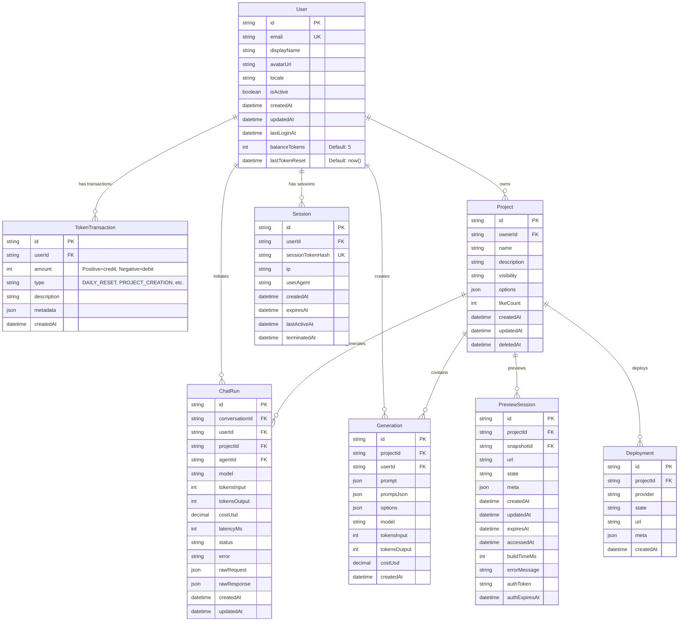
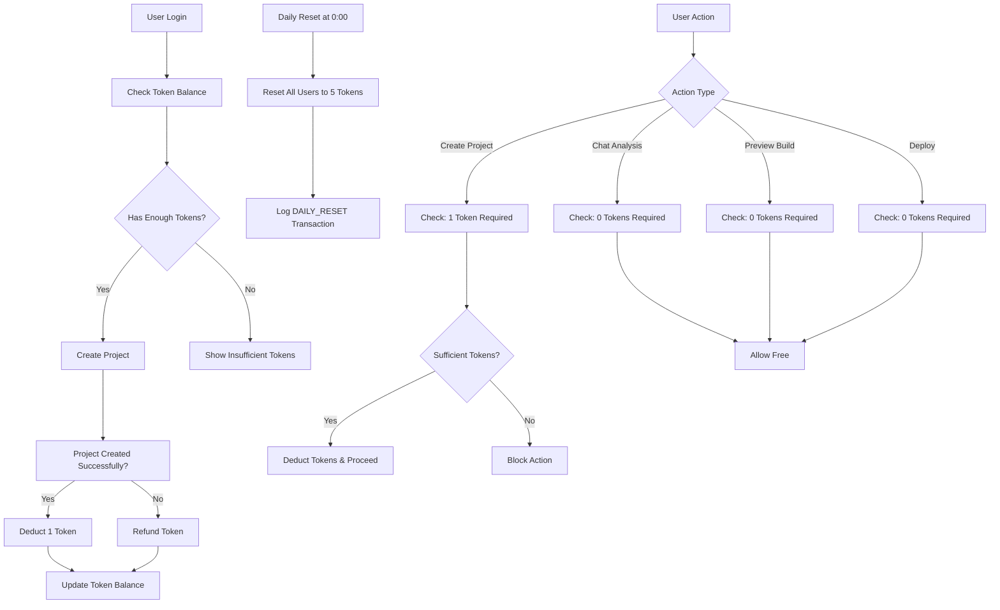
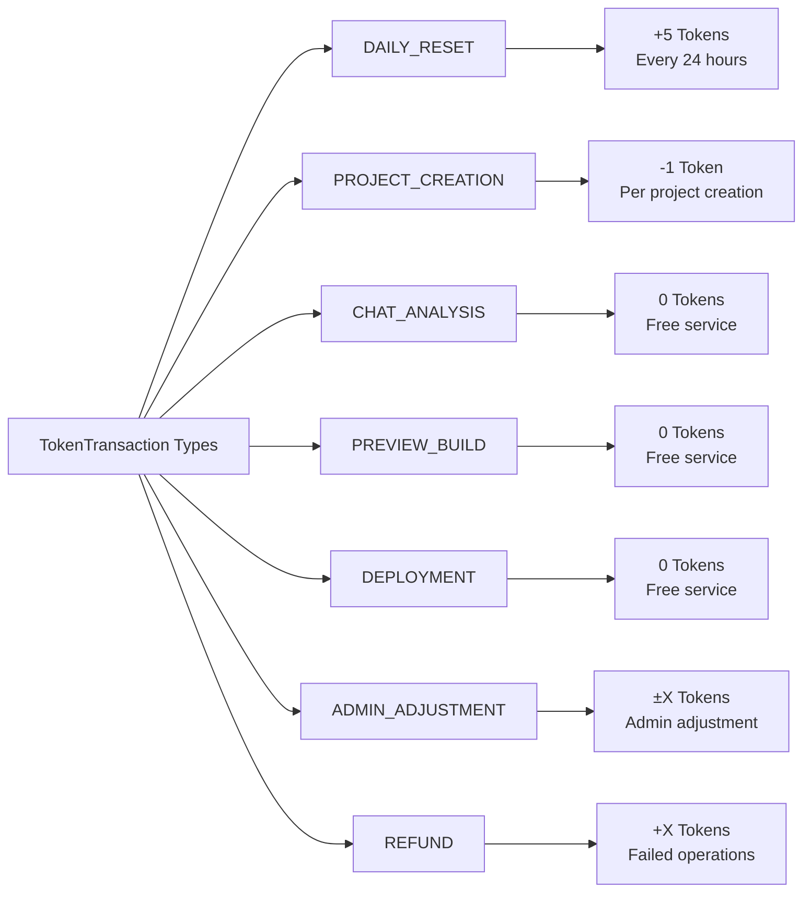
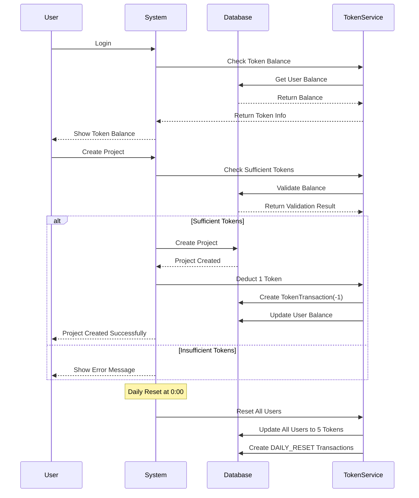

# 🗄️ Token System Database Diagram

## Database Schema สำหรับ Token System



## 🔄 Token Flow Diagram



## 📊 Token Transaction Types



## 🏗️ Database Tables Structure

### User Table (Updated)
```sql
model User {
  id                 String                  @id @default(uuid())
  email              String?                 @unique
  displayName        String?
  avatarUrl          String?
  locale             String?                 @default("th")
  isActive           Boolean                 @default(true)
  createdAt          DateTime                @default(now())
  updatedAt          DateTime                @updatedAt
  lastLoginAt        DateTime?
  
  -- Token System Fields
  balanceTokens      Int                    @default(5)
  lastTokenReset     DateTime?              @default(now())
  
  -- Relations
  tokenTransactions  TokenTransaction[]
  projects           Project[]
  sessions           Session[]
  -- ... other relations
}
```

### TokenTransaction Table (New)
```sql
model TokenTransaction {
  id          String              @id @default(uuid())
  userId      String
  amount      Int                 // Positive for credit, negative for debit
  type        TokenTransactionType
  description String?
  metadata    Json?               // Additional data like projectId, actionType
  createdAt   DateTime            @default(now())
  user        User                @relation(fields: [userId], references: [id], onDelete: Cascade)

  @@index([userId])
  @@index([type])
  @@index([createdAt])
}
```

### TokenTransactionType Enum
```sql
enum TokenTransactionType {
  DAILY_RESET        // +5 Tokens daily reset
  PROJECT_CREATION   // -1 Token per project
  CHAT_ANALYSIS      // 0 Tokens (free)
  PREVIEW_BUILD      // 0 Tokens (free)
  DEPLOYMENT         // 0 Tokens (free)
  ADMIN_ADJUSTMENT   // ±X Tokens admin adjustment
  REFUND             // +X Tokens refund
}
```

## 🔍 Key Relationships

1. **User → TokenTransaction**: One-to-Many
   - User can have multiple token transactions
   - Each transaction belongs to one user

2. **User → Project**: One-to-Many
   - User can create multiple projects
   - Each project costs 1 token

3. **TokenTransaction → Project**: Indirect relationship
   - PROJECT_CREATION transactions reference projectId in metadata
   - REFUND transactions reference original projectId

## 📈 Token Lifecycle



## 🛡️ Security & Constraints

1. **Atomic Operations**: All token operations use database transactions
2. **Balance Validation**: Always check balance before deducting
3. **Audit Trail**: Every token change is logged
4. **Refund Mechanism**: Failed operations refund tokens
5. **Daily Reset**: Automatic reset prevents token accumulation

## 📊 Indexes for Performance

```sql
-- User table indexes
@@index([email])
@@index([balanceTokens])
@@index([lastTokenReset])

-- TokenTransaction table indexes
@@index([userId])
@@index([type])
@@index([createdAt])
@@index([userId, createdAt])  -- Composite for user history
```

---

## 🎯 Summary

ระบบ Token Database ถูกออกแบบให้:
- **ง่ายต่อการใช้งาน**: User มี balanceTokens และ lastTokenReset
- **ครบถ้วน**: บันทึกทุกการเปลี่ยนแปลงใน TokenTransaction
- **ปลอดภัย**: ใช้ database transactions และ validation
- **ขยายได้**: รองรับการเพิ่มฟีเจอร์ใหม่ในอนาคต
- **มีประสิทธิภาพ**: มี indexes ที่เหมาะสมสำหรับ query patterns
