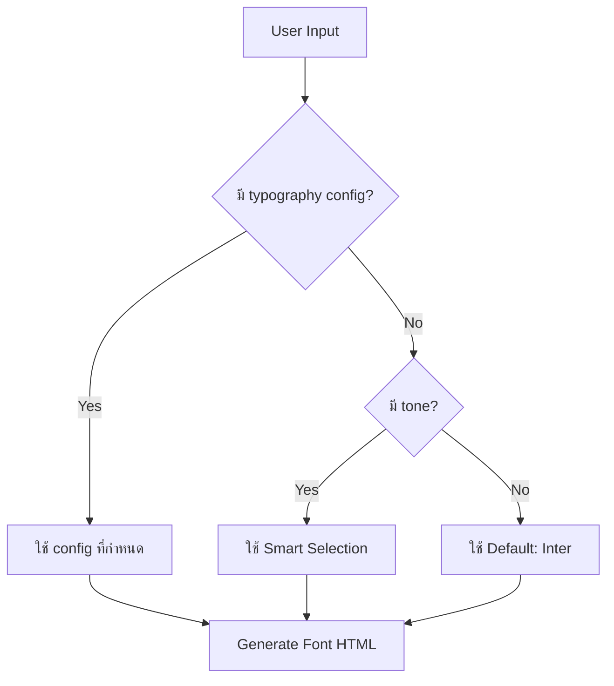

# 📝 แผนการจัดการฟอนต์ใน Template System

## 🎯 ภาพรวม (Overview)

เอกสารนี้อธิบายแผนการจัดการและปรับแต่งฟอนต์ (Font Customization) ในระบบ Template System ของ Midori

## 🔍 สถานะปัจจุบัน (Current State)

### 1. ฟอนต์ที่ใช้อยู่ (Current Fonts)
- **HTML Body**: `'Inter', sans-serif` (hardcoded ใน CSS template)
- **Code Editor**: `-apple-system, BlinkMacSystemFont, 'Segoe UI', 'Roboto'...` (system fonts)
- **Visual Edit Hints**: `-apple-system, sans-serif`

### 2. ตำแหน่งที่ใช้ฟอนต์ (Font Locations)
```
src/midori/agents/frontend-v2/template-system/
├── project-templates/index.ts (line 441)     - HTML body font
├── project-templates/index.ts (line 226)     - Visual edit hints font
└── shared-blocks/index.ts (line 716)         - Theme font
```

### 3. ข้อจำกัดปัจจุบัน (Current Limitations)
- ❌ ไม่สามารถปรับแต่งฟอนต์ได้
- ❌ ฟอนต์ hardcoded ใน CSS templates
- ❌ ไม่มีการจัดการ Google Fonts หรือ external fonts
- ❌ ไม่มีการรองรับ font fallbacks

## 🎨 วิธีแก้ไขที่แนะนำ (Recommended Solutions)

### แนวทางที่ 1: เพิ่ม Typography ใน GlobalSettings ⭐ (แนะนำ)

#### ข้อดี:
- ✅ ควบคุมแบบ centralize
- ✅ รองรับทั้ง local fonts และ Google Fonts
- ✅ มี fallback fonts
- ✅ ทำให้ทุกหน้าใช้ฟอนต์เดียวกัน

#### Implementation:

1. **อัปเดต GlobalSettings Interface**
```typescript
export interface GlobalSettings {
  palette: {
    primary: string;
    secondary?: string;
    bgTone?: string;
  };
  tokens: {
    radius: string;
    spacing: string;
  };
  typography: {                    // ⭐ เพิ่มใหม่
    fontFamily: string;            // ตัวอย่าง: "Inter" หรือ "Inter, sans-serif"
    googleFont?: string;           // ตัวอย่าง: "Inter:wght@300;400;600;700"
    fallback?: string[];           // ตัวอย่าง: ["sans-serif"]
  };
  tone?: string;
  reasoning?: string;
}
```

2. **อัปเดต CSS Template ให้รองรับ Font**
```css
/* src/index.css */
@import url('https://fonts.googleapis.com/css2?family={googleFont}'); /* ถ้ามี */

@layer base {
  html {
    font-size: 16px;
    line-height: 1.5;
    color: #3a3a3a;
    background-color: #fffaf0;
  }
  body {
    font-family: {fontFamily}, {fallback};  /* ใช้ placeholder */
    margin: 0;
    padding: 0;
  }
  h1, h2, h3, h4, h5, h6 {
    margin: 0;
    font-weight: 600;
  }
}
```

3. **ตัวอย่างการใช้งานใน Category**
```typescript
{
  id: "restaurant-classic",
  name: "Classic Restaurant",
  globalSettings: {
    palette: { primary: "red", secondary: "orange" },
    tokens: { radius: "8px", spacing: "1rem" },
    typography: {                        // ⭐ เพิ่มใหม่
      fontFamily: "Playfair Display",
      googleFont: "Playfair+Display:wght@400;700",
      fallback: ["serif"]
    }
  }
}
```

---

### แนวทางที่ 2: Font Presets + Selection

#### ข้อดี:
- ✅ ผู้ใช้เลือกได้ง่าย
- ✅ ไม่ต้องรู้รายละเอียด font technical
- ✅ รวม fonts ที่เหมาะกับแต่ละ business type

#### Implementation:

```typescript
export const FONT_PRESETS = {
  // Modern & Professional
  modern: {
    fontFamily: "Inter",
    googleFont: "Inter:wght@300;400;600;700",
    category: "professional",
    fallback: ["sans-serif"]
  },
  
  // Elegant & Luxury
  elegant: {
    fontFamily: "Playfair Display",
    googleFont: "Playfair+Display:wght@400;700",
    category: "luxury",
    fallback: ["serif"]
  },
  
  // Warm & Friendly
  warm: {
    fontFamily: "Poppins",
    googleFont: "Poppins:wght@300;400;600",
    category: "friendly",
    fallback: ["sans-serif"]
  },
  
  // Minimal & Clean
  minimal: {
    fontFamily: "Roboto",
    googleFont: "Roboto:wght@300;400;500;700",
    category: "minimal",
    fallback: ["sans-serif"]
  },
  
  // Artistic & Creative
  creative: {
    fontFamily: "Montserrat",
    googleFont: "Montserrat:wght@300;400;600;700",
    category: "creative",
    fallback: ["sans-serif"]
  },
  
  // Traditional & Serious
  traditional: {
    fontFamily: "Lora",
    googleFont: "Lora:wght@400;700",
    category: "serious",
    fallback: ["serif"]
  }
};
```

---

### แนวทางที่ 3: Smart Auto-Selection Based on Tone

#### ข้อดี:
- ✅ AI เลือกฟอนต์ที่เหมาะสมอัตโนมัติ
- ✅ ไม่ต้องกังวลเรื่องความเหมาะสม
- ✅ ใช้ตรรกะจาก tone และ business type

#### Implementation:

```typescript
export function selectFontForTone(tone: string): FontConfig {
  const fontMap: Record<string, FontConfig> = {
    'professional': FONT_PRESETS.modern,
    'luxury': FONT_PRESETS.elegant,
    'warm': FONT_PRESETS.warm,
    'minimal': FONT_PRESETS.minimal,
    'creative': FONT_PRESETS.creative,
    'serious': FONT_PRESETS.traditional
  };
  
  return fontMap[tone] || FONT_PRESETS.modern;
}

// Usage in template system
const fontConfig = selectFontForTone(globalSettings.tone);
globalSettings.typography = fontConfig;
```

---

## 🚀 แผนการ Implement แนะนำ (Recommended Implementation Plan)

### Phase 1: เพิ่ม Font Configuration ⭐

**Target Files:**
1. `src/midori/agents/frontend-v2/template-system/business-categories/index.ts`
   - เพิ่ม `typography` field ใน `GlobalSettings`
   
2. `src/midori/agents/frontend-v2/template-system/project-templates/index.ts`
   - เพิ่ม font placeholders ใน CSS templates
   - เพิ่ม Google Fonts import link

3. Create: `src/midori/agents/frontend-v2/template-system/shared-blocks/font-presets.ts`
   - Define font presets

### Phase 2: Update All Categories

**Target Files:** ทุกไฟล์ใน `business-categories/categories/`
- เพิ่ม `typography` config ในทุก category

### Phase 3: Update Renderer

**Target File:** `src/midori/agents/frontend-v2/template-system/override-system/renderer.ts`
- เพิ่ม logic สำหรับ replace font placeholders
- Handle Google Fonts import

### Phase 4: Update Prompts

**Target Files:** ทุกไฟล์ใน `prompt-templates/`
- เพิ่ม typography field ใน JSON schema examples

---

## 📋 ตัวอย่างข้อมูล (Data Examples)

### ตัวอย่าง Typography Config ที่ใช้ใน Categories

```typescript
// Restaurant Categories
{
  id: "restaurant-luxury",
  typography: {
    fontFamily: "Playfair Display",
    googleFont: "Playfair+Display:wght@400;700",
    fallback: ["serif"]
  }
}

// E-commerce Categories
{
  id: "ecommerce-modern",
  typography: {
    fontFamily: "Inter",
    googleFont: "Inter:wght@300;400;600;700",
    fallback: ["sans-serif"]
  }
}

// Portfolio Categories
{
  id: "portfolio-creative",
  typography: {
    fontFamily: "Montserrat",
    googleFont: "Montserrat:wght@300;400;600;700",
    fallback: ["sans-serif"]
  }
}
```

---

## 🎯 ขั้นตอนการทำงาน (Workflow)

### 1. การเลือกรูปแบบฟอนต์ (Font Selection)



### 2. การ Render (Rendering Process)

1. Extract typography config จาก `GlobalSettings`
2. สร้าง Google Fonts import (ถ้ามี)
3. Replace font placeholders ใน CSS templates
4. Generate HTML with fonts

---

## 📊 Impact Analysis

### Files ที่ต้องแก้ไข:

| File | Changes | Priority |
|------|---------|----------|
| `business-categories/index.ts` | เพิ่ม typography interface | ⭐⭐⭐ |
| `project-templates/index.ts` | เพิ่ม font placeholders | ⭐⭐⭐ |
| `override-system/renderer.ts` | Handle font replacements | ⭐⭐⭐ |
| All category files | เพิ่ม typography config | ⭐⭐ |
| All prompt templates | เพิ่ม typography example | ⭐⭐ |
| Create: `font-presets.ts` | Define presets | ⭐⭐ |

### Categories ที่แนะนำให้เริ่มต้น:

1. ✅ Restaurant (หลาย tone: luxury, casual, minimal)
2. ✅ E-commerce (professional tone)
3. ✅ Portfolio (creative tone)
4. ✅ Healthcare (professional + warm)
5. ✅ Academy (serious + intellectual)

---

## 🔄 Migration Strategy

### Step 1: Backward Compatibility
- กำหนด default font: `Inter` ถ้าไม่มี typography config
- ตรวจสอบว่าทุก template ยังทำงานได้

### Step 2: Gradual Rollout
- เริ่มจาก categories ที่มี tone ชัดเจน
- ทดสอบกับแต่ละ business category

### Step 3: Full Adoption
- อัปเดตทุก category
- เพิ่ม typography ใน AI prompts

---

## ✅ Checklist

- [ ] เพิ่ม typography field ใน GlobalSettings interface
- [ ] สร้าง font-presets.ts
- [ ] อัปเดต CSS templates ให้รองรับ font placeholders
- [ ] อัปเดต renderer เพื่อ handle font replacements
- [ ] เพิ่ม typography ในทุก business categories
- [ ] อัปเดต AI prompts ให้รวม typography
- [ ] ทดสอบกับหลาย categories
- [ ] Document API สำหรับใช้งาน

---

## 💡 สรุป

การเพิ่มระบบ Font Customization จะทำให้:
1. ✅ เว็บไซต์ที่สร้างมีความหลากหลายมากขึ้น
2. ✅ ฟอนต์เหมาะสมกับแต่ละ business type และ tone
3. ✅ รองรับทั้ง Google Fonts และ system fonts
4. ✅ มี fallback fonts เพื่อความเสถียร
5. ✅ ใช้ได้ง่ายทั้ง manual config และ smart selection

**แนะนำ: เริ่มจาก Phase 1 (เพิ่ม Font Configuration) ก่อน** ⭐

