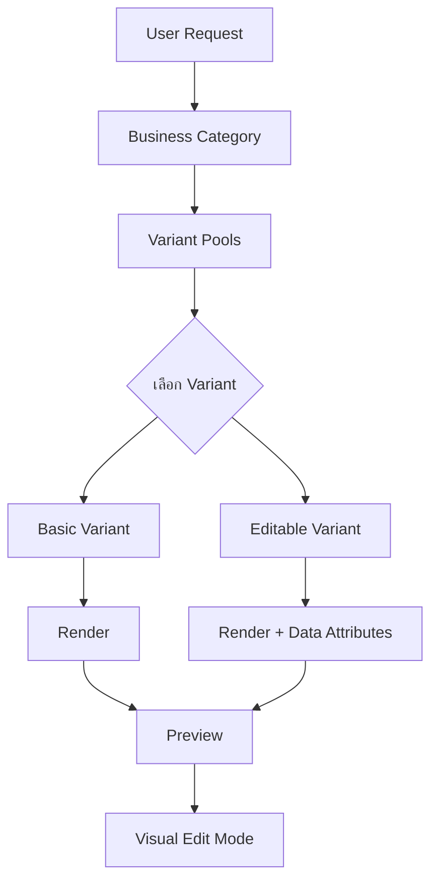

# 📖 คู่มือการเพิ่ม Variant ใหม่ (Variant Creation Guide)

> คู่มือฉบับสมบูรณ์สำหรับการสร้างและเพิ่ม Block Variants ใน Midori Template System

**เวอร์ชัน:** 1.0  
**อัปเดตล่าสุด:** 16 ตุลาคม 2025  
**ผู้เขียน:** Midori Team

---

## 📋 สารบัญ

1. [ภาพรวม Variant System](#ภาพรวม-variant-system)
2. [ประเภทของ Variants](#ประเภทของ-variants)
3. [เพิ่ม Variant แบบง่าย (Basic Variant)](#เพิ่ม-variant-แบบง่าย)
4. [เพิ่ม Variant แบบแก้ไขได้ (Editable Variant)](#เพิ่ม-variant-แบบแก้ไขได้)
5. [จัดการ Array Items](#จัดการ-array-items)
6. [Variant Pools System](#variant-pools-system)
7. [Best Practices](#best-practices)
8. [Common Pitfalls](#common-pitfalls)
9. [Testing & Validation](#testing--validation)
10. [Checklist](#checklist)
11. [ตัวอย่างเต็ม](#ตัวอย่างเต็ม)

---

## 🎯 ภาพรวม Variant System

### Variant คือ?

**Variant** คือรูปแบบการออกแบบที่แตกต่างกันของ Block เดียวกัน เช่น:
- `hero-basic` → Hero section แบบมาตรฐาน
- `hero-minimal` → Hero section แบบเรียบง่าย
- `hero-fullscreen` → Hero section แบบเต็มจอ

### โครงสร้างระบบ

```
Template System
├── Shared Blocks (แม่แบบหลัก)
│   ├── hero-basic
│   ├── menu-basic
│   └── footer-basic
├── Variants (รูปแบบต่างๆ ของแต่ละ block)
│   ├── hero-variants.ts
│   │   ├── hero-minimal
│   │   ├── hero-split
│   │   ├── hero-fullscreen
│   │   ├── hero-stats
│   │   └── hero-cards
│   ├── menu-variants.ts
│   └── footer-variants.ts
├── Business Categories (ธุรกิจแต่ละประเภท)
│   ├── restaurant.ts (ใช้ variants ไหนได้บ้าง)
│   ├── ecommerce.ts
│   └── portfolio.ts
└── Variant Pools (ควบคุม variants ตาม category)
```

### Architecture Diagram



---

## 📦 ประเภทของ Variants

### 1. Basic Variant (พื้นฐาน)
- ใช้ placeholders ธรรมดา
- ไม่มี Visual Edit features
- เหมาะสำหรับ static content

**ตัวอย่าง:**
```typescript
{
  id: 'hero-minimal',
  template: `<h1>{heading}</h1>`,
  placeholders: {
    heading: { type: 'string', required: true }
  }
}
```

### 2. Editable Variant (แก้ไขได้)
- มี `data-editable` attributes
- รองรับ Visual Edit Mode
- ผู้ใช้คลิกแก้ไขได้เลย

**ตัวอย่าง:**
```typescript
{
  id: 'hero-editable',
  template: `
    <h1 
      data-editable="true"
      data-block-id="hero-basic"
      data-field="heading"
      data-type="heading"
    >
      {heading}
    </h1>
  `
}
```

### 3. Array-based Variant (มี Array Items)
- มีข้อมูลแบบ array (menu items, features, testimonials)
- ต้องสร้าง generator function
- แต่ละ item มี data attributes แยกกัน

**ตัวอย่าง:**
```typescript
{
  id: 'menu-basic',
  template: `<div>{menuItems}</div>`,
  placeholders: {
    menuItems: { type: 'array', required: true }
  },
  // มี generator function แยก
}
```

---

## 🔧 เพิ่ม Variant แบบง่าย

### Step 1: สร้าง Variant Definition

**ไฟล์:** `Midori/src/midori/agents/frontend-v2/template-system/shared-blocks/variants/hero-variants.ts`

```typescript
export const HERO_SIMPLE: TemplateVariant = {
  id: 'hero-simple',
  template: `
    <section className="py-20 bg-gradient-to-r from-blue-500 to-purple-600">
      <div className="container mx-auto text-center">
        <h1 className="text-5xl font-bold text-white mb-6">
          {heading}
        </h1>
        <p className="text-xl text-white/90 mb-8">
          {subheading}
        </p>
        <button className="px-8 py-3 bg-white text-blue-600 rounded-lg font-semibold hover:bg-gray-100 transition-colors">
          {ctaText}
        </button>
      </div>
    </section>
  `,
  placeholders: {
    heading: {
      type: 'string',
      required: true,
      default: 'ยินดีต้อนรับ'
    },
    subheading: {
      type: 'string',
      required: true,
      default: 'สร้างเว็บไซต์สวยๆ ได้ง่ายๆ'
    },
    ctaText: {
      type: 'string',
      required: true,
      default: 'เริ่มต้นใช้งาน'
    }
  }
};
```

### Step 2: Register Variant

**ไฟล์:** `Midori/src/midori/agents/frontend-v2/template-system/shared-blocks/index.ts`

```typescript
// เพิ่ม import
import { HERO_SIMPLE } from './variants/hero-variants';

// เพิ่มใน SHARED_BLOCKS array
export const SHARED_BLOCKS: TemplateBlock[] = [
  {
    id: 'hero-basic',
    template: '...',
    placeholders: { ... },
    variants: [
      HERO_MINIMAL,
      HERO_SPLIT,
      HERO_FULLSCREEN,
      HERO_STATS,
      HERO_CARDS,
      HERO_SIMPLE  // ← เพิ่มตรงนี้
    ]
  },
  // ... blocks อื่นๆ
];
```

### Step 3: เพิ่มใน Variant Pools

**ไฟล์:** `Midori/src/midori/agents/frontend-v2/template-system/business-categories/categories/restaurants.ts`

```typescript
export const RESTAURANT_CATEGORY: BusinessCategoryManifest = {
  id: 'restaurant',
  // ... other configs
  variantPools: {
    'hero-basic': {
      allowedVariants: [
        'hero-stats',
        'hero-split',
        'hero-fullscreen',
        'hero-cards',
        'hero-simple'  // ← เพิ่มตรงนี้
      ],
      defaultVariant: 'hero-stats',
      randomSelection: true
    }
  }
};
```

### Step 4: Test

```bash
# Run validation
npm run test:validate-manifests

# หรือใช้ demo
npm run demo:layout-variants
```

---

## 🎨 เพิ่ม Variant แบบแก้ไขได้

### ทำไมต้องมี Visual Edit?

Visual Edit Mode ทำให้ผู้ใช้สามารถ:
- คลิกบน element ที่ต้องการแก้ไข
- แก้ไขข้อความ/รูปภาพใน panel ด้านขวา
- เห็นผลทันทีโดยไม่ต้องใช้ AI

### กลไกการทำงาน

```
1. Renderer เพิ่ม data-* attributes ตอน render
   ↓
2. User เปิด Edit Mode (Alt + E)
   ↓
3. User คลิกบน element ที่มี data-editable="true"
   ↓
4. Iframe อ่าน attributes และส่งกลับไปยัง parent
   ↓
5. Parent แสดง Edit Panel
   ↓
6. User แก้ไขและบันทึก
   ↓
7. API อัปเดต database และ refresh preview
```

### Step 1: สร้าง Editable Variant

**2 วิธีในการเพิ่ม Data Attributes:**

#### วิธีที่ 1: Auto-wrap (สำหรับ Simple Placeholders)

Renderer จะ wrap อัตโนมัติด้วย `<span data-editable>`:

```typescript
export const HERO_AUTO: TemplateVariant = {
  id: 'hero-auto',
  template: `
    <section className="py-20">
      <div className="container">
        {/* Renderer จะ wrap {heading} ด้วย span + data attributes */}
        <h1 className="text-4xl font-bold">
          {heading}
        </h1>
      </div>
    </section>
  `,
  placeholders: {
    heading: { type: 'string', required: true }
  }
};
```

**ผลลัพธ์ที่ render:**
```html
<h1 class="text-4xl font-bold">
  <span 
    data-editable="true"
    data-block-id="hero-basic"
    data-field="heading"
    data-type="heading"
    class="midori-editable"
  >
    ยินดีต้อนรับ
  </span>
</h1>
```

#### วิธีที่ 2: Manual (สำหรับ Semantic HTML และ Complex Elements)

เพิ่ม attributes เองในตัว element:

```typescript
export const HERO_MANUAL: TemplateVariant = {
  id: 'hero-manual',
  template: `
    <section className="py-20">
      <div className="container">
        {/* เพิ่ม data attributes เอง */}
        <h1 
          className="text-4xl font-bold"
          data-editable="true"
          data-block-id="hero-basic"
          data-field="heading"
          data-type="heading"
        >
          {heading}
        </h1>
        
        <p 
          className="text-lg text-gray-600"
          data-editable="true"
          data-block-id="hero-basic"
          data-field="subheading"
          data-type="text"
        >
          {subheading}
        </p>
        
        {/* สำหรับ images - ต้องเพิ่มที่ element */}
        
      </div>
    </section>
  `,
  placeholders: {
    heading: { type: 'string', required: true },
    subheading: { type: 'string', required: true },
    heroImage: { type: 'string', required: true },
    heroImageAlt: { type: 'string', required: false }
  }
};
```

### Step 2: Data Attributes Structure

#### Attributes ที่จำเป็น:

| Attribute | ค่า | คำอธิบาย |
|-----------|-----|----------|
| `data-editable` | `"true"` | บอกว่า element นี้แก้ไขได้ |
| `data-block-id` | `"hero-basic"` | Block ID ที่ element นี้อยู่ |
| `data-field` | `"heading"` | ชื่อ field/placeholder |
| `data-type` | `"heading"` | ประเภท (text, heading, button, badge, image) |

#### Attributes เพิ่มเติม (สำหรับ Array Items):

| Attribute | ค่า | คำอธิบาย |
|-----------|-----|----------|
| `data-item-index` | `"0"` | Index ของ item ใน array |
| `data-field` | `"menuItems[0].name"` | Field path แบบ array notation |

#### Field Types:

- `text` - ข้อความธรรดา (paragraphs, descriptions)
- `heading` - หัวข้อ (h1, h2, h3)
- `subheading` - หัวข้อรอง
- `button` - ข้อความบนปุ่ม
- `badge` - ป้ายเล็กๆ (tags, categories)
- `image` - URL รูปภาพ

### Step 3: ⚠️ สำคัญ! - จัดการ Attribute Values

**❌ ห้ามทำ:**
```html
<!-- ❌ ห้าม wrap attribute values - จะทำให้ JSX พัง -->
url</span>" />
<a href="<span data-editable>link</span>">Text</a>
```

**✅ ถูกต้อง:**
```html
<!-- ✅ เพิ่ม data attributes ที่ element เอง -->


<a 
  href="{link}"
  data-editable="true"
  data-field="link"
  data-type="text"
>
  Link Text
</a>
```

**Renderer มี logic ป้องกัน:**
```typescript
// ใน renderer.ts
private isAttributeValue(field: string): boolean {
  return field.endsWith('Image') || 
         field.endsWith('ImageAlt') || 
         field.endsWith('Url') ||
         field.endsWith('Alt');
}

// ถ้าเป็น attribute value จะไม่ wrap
if (this.isAttributeValue(placeholder)) {
  replacements[placeholder] = this.escapeHtml(String(value));
} else {
  // wrap ด้วย data attributes
  replacements[placeholder] = this.wrapWithDataAttributes(...);
}
```

---

## 🔢 จัดการ Array Items

Array items (menu items, features, testimonials, stats) ต้องการการจัดการพิเศษ

### Step 1: สร้าง Generator Function

**ไฟล์:** `Midori/src/midori/agents/frontend-v2/template-system/override-system/renderer.ts`

```typescript
/**
 * Generate testimonials HTML with editable attributes
 */
private generateTestimonials(
  testimonials: any[], 
  primary: string,
  lang: string
): string {
  return testimonials.map((item: any, index: number) => 
    `<div 
      className="bg-white p-6 rounded-lg shadow-md"
      data-editable="true"
      data-block-id="testimonial-basic"
      data-field="testimonials"
      data-item-index="${index}"
      data-type="testimonial"
    >
      {/* Quote */}
      <p 
        data-editable="true"
        data-block-id="testimonial-basic"
        data-field="testimonials[${index}].quote"
        data-type="text"
        className="text-gray-700 mb-4 italic"
      >
        "${this.escapeHtml(item.quote || 'คำพูดจากลูกค้า')}"
      </p>
      
      {/* Avatar Image */}
      
      
      {/* Name */}
      <h4 
        data-editable="true"
        data-block-id="testimonial-basic"
        data-field="testimonials[${index}].name"
        data-type="heading"
        className="font-semibold"
      >
        ${this.escapeHtml(item.name || 'ชื่อลูกค้า')}
      </h4>
      
      {/* Role */}
      <p 
        data-editable="true"
        data-block-id="testimonial-basic"
        data-field="testimonials[${index}].role"
        data-type="text"
        className="text-sm text-gray-500"
      >
        ${this.escapeHtml(item.role || 'ตำแหน่ง')}
      </p>
    </div>`
  ).join('\n');
}
```

### Step 2: Register Generator

```typescript
// ใน renderBlock() method
private renderBlock(block: ConcreteBlock, userData: Record<string, any>): string {
  // ... existing code
  
  // เพิ่ม special placeholder generator
  if (block.placeholders.testimonials && userData.testimonials) {
    const testimonialsHtml = this.generateTestimonials(
      userData.testimonials,
      this.getPrimaryColor(block.id),
      userData.lang || 'th'
    );
    replacements['testimonials'] = testimonialsHtml;
  }
  
  // ... rest of the code
}
```

### Step 3: สร้าง Variant

```typescript
export const TESTIMONIAL_BASIC: TemplateBlock = {
  id: 'testimonial-basic',
  template: `
    <section className="py-16 bg-gray-50">
      <div className="container mx-auto">
        <h2 
          data-editable="true"
          data-block-id="testimonial-basic"
          data-field="heading"
          data-type="heading"
          className="text-3xl font-bold text-center mb-12"
        >
          {heading}
        </h2>
        
        <div className="grid grid-cols-1 md:grid-cols-3 gap-8">
          {testimonials}
        </div>
      </div>
    </section>
  `,
  placeholders: {
    heading: {
      type: 'string',
      required: true,
      default: 'ความคิดเห็นจากลูกค้า'
    },
    testimonials: {
      type: 'array',
      required: true,
      items: {
        quote: { type: 'string' },
        avatar: { type: 'string' },
        name: { type: 'string' },
        role: { type: 'string' }
      }
    }
  }
};
```

### Array Field Naming Convention

| Pattern | คำอธิบาย | ตัวอย่าง |
|---------|----------|----------|
| `fieldName` | Field ของ container | `testimonials` |
| `fieldName[0]` | Item ที่ 0 | `testimonials[0]` |
| `fieldName[0].property` | Property ของ item | `testimonials[0].quote` |

---

## 🎯 Variant Pools System

Variant Pools ควบคุมว่า business category แต่ละอันสามารถใช้ variants อะไรได้บ้าง

### ทำไมต้องมี Variant Pools?

1. **ป้องกันการใช้ variant ที่ไม่เหมาะสม** - เช่น `hero-minimal` ไม่เหมาะกับ luxury restaurant
2. **ควบคุมความหลากหลาย** - บาง category ควรมี random selection บางอันควร fixed
3. **จัดการ constraints** - กำหนดเงื่อนไขตาม business type และ tone

### Interface

```typescript
export interface VariantPools {
  [blockId: string]: {
    allowedVariants: string[];        // variants ที่ใช้ได้
    defaultVariant?: string;          // variant เริ่มต้น
    randomSelection?: boolean;        // เปิด/ปิดการสุ่ม
    constraints?: VariantConstraints; // เงื่อนไขเพิ่มเติม
  };
}

export interface VariantConstraints {
  minVariants?: number;
  maxVariants?: number;
  requiredVariants?: string[];
  excludedVariants?: string[];
  businessType?: string[];
  tone?: string[];
}
```

### ตัวอย่างการใช้งาน

#### 1. Restaurant Category (หลากหลาย)

```typescript
export const RESTAURANT_CATEGORY: BusinessCategoryManifest = {
  id: 'restaurant',
  variantPools: {
    'hero-basic': {
      allowedVariants: ['hero-stats', 'hero-split', 'hero-fullscreen', 'hero-cards'],
      defaultVariant: 'hero-stats',
      randomSelection: true, // 🎲 สุ่มเพื่อความหลากหลาย
      constraints: {
        businessType: ['restaurant', 'food-service', 'dining'],
        tone: ['warm', 'inviting', 'appetizing']
      }
    },
    'menu-basic': {
      allowedVariants: ['menu-basic', 'menu-list', 'menu-masonry'],
      defaultVariant: 'menu-basic',
      randomSelection: false
    }
  }
};
```

#### 2. Luxury Restaurant (เฉพาะเจาะจง)

```typescript
export const LUXURY_RESTAURANT_CATEGORY: BusinessCategoryManifest = {
  id: 'restaurant-luxury',
  variantPools: {
    'hero-basic': {
      allowedVariants: ['hero-fullscreen', 'hero-minimal'],
      defaultVariant: 'hero-fullscreen',
      randomSelection: false, // ไม่สุ่ม - ใช้ fixed variant
      constraints: {
        businessType: ['restaurant', 'luxury', 'fine-dining'],
        tone: ['luxury', 'elegant', 'sophisticated', 'premium']
      }
    }
  }
};
```

#### 3. E-commerce (มีเงื่อนไข)

```typescript
export const ECOMMERCE_CATEGORY: BusinessCategoryManifest = {
  id: 'ecommerce',
  variantPools: {
    'hero-basic': {
      allowedVariants: ['hero-stats', 'hero-split', 'hero-cards'],
      defaultVariant: 'hero-stats',
      randomSelection: false,
      constraints: {
        requiredVariants: ['hero-stats'], // ต้องมี stats
        excludedVariants: ['hero-minimal'], // ห้ามใช้ minimal
        businessType: ['ecommerce', 'retail', 'online-store'],
        tone: ['professional', 'trustworthy', 'modern']
      }
    }
  }
};
```

### Utility Functions

```typescript
// ดู variants ที่ใช้ได้
const variants = getAllowedVariants('restaurant', 'hero-basic');
// Returns: ['hero-stats', 'hero-split', 'hero-fullscreen', 'hero-cards']

// ดู default variant
const defaultVariant = getDefaultVariant('restaurant', 'hero-basic');
// Returns: 'hero-stats'

// ตรวจสอบว่า variant ใช้ได้หรือไม่
const isAllowed = isVariantAllowed('restaurant', 'hero-basic', 'hero-minimal');
// Returns: false

// สุ่ม variant จาก pool
const randomVariant = getRandomVariantFromPool('restaurant', 'hero-basic');
// Returns: random variant from allowed list
```

---

## ✅ Best Practices

### 1. Naming Conventions

#### Variant IDs
```typescript
// ✅ ดี - อธิบายชัดเจน
'hero-minimal'
'hero-split-image'
'menu-masonry-grid'
'footer-mega-columns'

// ❌ ไม่ดี - คลุมเครือ
'hero-v2'
'menu-new'
'footer-big'
```

#### Field Names
```typescript
// ✅ ดี - สื่อความหมาย
heading, subheading, ctaText, heroImage
menuItems, features, testimonials

// ❌ ไม่ดี - สั้นเกินไป หรือยาวเกินไป
h1, txt, buttonText1
heroSectionMainHeadingTextContent
```

### 2. Placeholder Structure

```typescript
// ✅ ดี - มี type, required, default
placeholders: {
  heading: {
    type: 'string',
    required: true,
    default: 'ยินดีต้อนรับ'
  },
  showBadge: {
    type: 'boolean',
    required: false,
    default: true
  }
}

// ❌ ไม่ดี - ขาดข้อมูล
placeholders: {
  heading: {}
}
```

### 3. Responsive Design

```typescript
// ✅ ดี - มี responsive classes
template: `
  <div className="grid grid-cols-1 md:grid-cols-2 lg:grid-cols-3 gap-4">
    <div className="p-4 text-sm md:text-base lg:text-lg">
      {content}
    </div>
  </div>
`

// ❌ ไม่ดี - ขนาดตายตัว
template: `
  <div style="width: 1200px">
    {content}
  </div>
`
```

### 4. Accessibility

```typescript
// ✅ ดี - มี alt, aria, semantic HTML
template: `
  
  <button aria-label="{ctaText}">
    {ctaText}
  </button>
  <h1>{heading}</h1>
`

// ❌ ไม่ดี - ขาด accessibility
template: `
  
  <div onclick="...">{ctaText}</div>
  <div className="text-3xl">{heading}</div>
`
```

### 5. Performance

```typescript
// ✅ ดี - lazy loading, optimized images
template: `
  
`

// ✅ ดี - conditional rendering
template: `
  {showStats && (
    <div className="stats">...</div>
  )}
`
```

### 6. Data Attributes Best Practices

```typescript
// ✅ ดี - แยก attributes ชัดเจน
<h1 
  data-editable="true"
  data-block-id="hero-basic"
  data-field="heading"
  data-type="heading"
>
  {heading}
</h1>

// ✅ ดี - array items มี index
<div
  data-editable="true"
  data-field="menuItems[${index}].name"
  data-item-index="${index}"
>
  {item.name}
</div>

// ❌ ไม่ดี - ขาด attributes
<h1>{heading}</h1>

// ❌ ไม่ดี - wrap attribute values
{image}</span>" />
```

---

## ⚠️ Common Pitfalls

### 1. ❌ Wrapping Attribute Values

**ปัญหา:**
```typescript
// ❌ ผิด - จะทำให้ JSX พัง
template: ``
// Renderer wrap เป็น:
// url</span>" />
```

**วิธีแก้:**
```typescript
// ✅ ถูกต้อง - เพิ่ม attributes ที่ element
template: `
  
`
```

### 2. ❌ ลืม Escape HTML

**ปัญหา:**
```typescript
// ❌ XSS vulnerability
return `<h1>${value}</h1>`;
```

**วิธีแก้:**
```typescript
// ✅ ใช้ escapeHtml
return `<h1>${this.escapeHtml(value)}</h1>`;
```

### 3. ❌ Array Index ไม่ตรงกัน

**ปัญหา:**
```typescript
// ❌ data-field ไม่ตรงกับ data-item-index
data-field="menuItems[0].name"
data-item-index="1"  // ← ผิด
```

**วิธีแก้:**
```typescript
// ✅ ใช้ตัวแปร index เดียวกัน
data-field="menuItems[${index}].name"
data-item-index="${index}"
```

### 4. ❌ Missing Data Attributes

**ปัญหา:**
```typescript
// ❌ ขาด data-editable
<h1 data-field="heading">{heading}</h1>
```

**วิธีแก้:**
```typescript
// ✅ ครบทุก attributes
<h1 
  data-editable="true"
  data-block-id="hero-basic"
  data-field="heading"
  data-type="heading"
>
  {heading}
</h1>
```

### 5. ❌ ลืม Register Variant

**ปัญหา:**
```typescript
// สร้าง variant แล้ว แต่ลืม export หรือ register
export const MY_VARIANT = { ... };
// ← ลืมเพิ่มใน SHARED_BLOCKS
```

**วิธีแก้:**
```typescript
// ✅ Register ใน index.ts
import { MY_VARIANT } from './variants/my-variants';

export const SHARED_BLOCKS: TemplateBlock[] = [
  {
    id: 'my-block',
    variants: [MY_VARIANT]  // ← เพิ่มตรงนี้
  }
];
```

### 6. ❌ Placeholder Type ไม่ถูกต้อง

**ปัญหา:**
```typescript
// ❌ type ผิด
placeholders: {
  menuItems: { type: 'string' }  // ← ควรเป็น 'array'
}
```

**วิธีแก้:**
```typescript
// ✅ type ถูกต้อง
placeholders: {
  menuItems: { 
    type: 'array',
    items: {
      name: { type: 'string' },
      price: { type: 'number' }
    }
  }
}
```

---

## 🧪 Testing & Validation

### 1. Validate Manifests

```bash
# ทดสอบว่า manifests ถูกต้อง
cd Midori/src/midori/agents/frontend-v2
npm run test:validate-manifests
```

**ควรเห็น:**
```
✅ All validations passed!
✅ Template system is correctly configured.
✅ Found 14 variants
✅ All placeholders valid
```

### 2. Test Visual Edit Mode

**Step-by-step:**

1. **สร้างโปรเจคใหม่หรือ Regenerate**
   ```typescript
   // ใน Chat/Edit
   "เปลี่ยน hero heading เป็น 'ทดสอบ Visual Edit'"
   ```

2. **เปิด Preview**
   - ไปหน้า Preview
   - รอให้โหลดเสร็จ

3. **ตรวจสอบ Console**
   ```
   ✅ Visual Edit script loaded (embedded)
   ✅ Visual Edit script initialized
   ```

4. **เปิด Edit Mode**
   - กด `Alt + E`
   - หรือคลิกปุ่ม "👁️ Preview"

5. **ทดสอบ Hover**
   - Hover บน text/heading
   - ควรเห็น blue dashed outline
   - ควรเห็น tooltip แสดงชื่อ field

6. **ทดสอบ Click**
   - คลิกบน element
   - ควรเห็น panel ทางขวา
   - ควรเห็นชื่อ field และค่าปัจจุบัน

7. **ทดสอบ Save**
   - แก้ไขข้อความ
   - กด Save
   - Preview ควร refresh
   - ข้อความควรเปลี่ยน

### 3. Test Array Items

```typescript
// ตรวจสอบว่า array items มี data attributes ครบ
document.querySelectorAll('[data-item-index]').forEach(el => {
  console.log({
    index: el.dataset.itemIndex,
    field: el.dataset.field,
    type: el.dataset.type
  });
});
```

### 4. Test Responsive Design

```bash
# เปิด DevTools
# กด F12 → Toggle Device Toolbar
# ทดสอบขนาดหน้าจอต่างๆ:
# - Mobile (375px)
# - Tablet (768px)
# - Desktop (1920px)
```

### 5. Test Accessibility

```bash
# ใช้ Lighthouse
# DevTools → Lighthouse → Accessibility
# ควรได้คะแนน > 90
```

---

## ✅ Checklist

### เมื่อเพิ่ม Variant ใหม่

- [ ] **Step 1: สร้าง Variant Definition**
  - [ ] สร้างไฟล์ใน `variants/` folder
  - [ ] กำหนด `id`, `template`, `placeholders`
  - [ ] เพิ่ม data attributes (ถ้าต้องการ editable)
  - [ ] มี default values สำหรับทุก placeholder

- [ ] **Step 2: Register Variant**
  - [ ] Import ใน `shared-blocks/index.ts`
  - [ ] เพิ่มใน `variants` array ของ block

- [ ] **Step 3: อัปเดต Variant Pools**
  - [ ] เพิ่มใน `allowedVariants` ของ business categories
  - [ ] กำหนด `defaultVariant` (ถ้าต้องการ)
  - [ ] ตั้งค่า `randomSelection`
  - [ ] เพิ่ม `constraints` (ถ้ามี)

- [ ] **Step 4: Generator Functions (สำหรับ Array)**
  - [ ] สร้าง generator function ใน `renderer.ts`
  - [ ] เพิ่ม data attributes สำหรับแต่ละ item
  - [ ] Register ใน `renderBlock()` method

- [ ] **Step 5: Testing**
  - [ ] รัน `test:validate-manifests`
  - [ ] สร้างโปรเจคทดสอบ
  - [ ] ทดสอบ responsive design
  - [ ] ทดสอบ Visual Edit Mode (ถ้ามี)
  - [ ] ทดสอบ accessibility

- [ ] **Step 6: Documentation**
  - [ ] อัปเดต CHANGELOG
  - [ ] เพิ่มตัวอย่างใน README
  - [ ] เพิ่ม comments ในโค้ด

---

## 📦 ตัวอย่างเต็ม

### ตัวอย่างที่ 1: Testimonial Variant (ง่าย)

**1. สร้าง Variant**

```typescript
// Midori/src/midori/agents/frontend-v2/template-system/shared-blocks/variants/testimonial-variants.ts

import { TemplateBlock } from '../types';

export const TESTIMONIAL_BASIC: TemplateBlock = {
  id: 'testimonial-basic',
  template: `
    <section className="py-16 bg-gray-50">
      <div className="container mx-auto px-4">
        <h2 
          data-editable="true"
          data-block-id="testimonial-basic"
          data-field="heading"
          data-type="heading"
          className="text-3xl font-bold text-center mb-12"
        >
          {heading}
        </h2>
        
        <div className="grid grid-cols-1 md:grid-cols-3 gap-8">
          {testimonials}
        </div>
      </div>
    </section>
  `,
  placeholders: {
    heading: {
      type: 'string',
      required: true,
      default: 'ความคิดเห็นจากลูกค้า'
    },
    testimonials: {
      type: 'array',
      required: true,
      items: {
        quote: { type: 'string', required: true },
        avatar: { type: 'string', required: false },
        name: { type: 'string', required: true },
        role: { type: 'string', required: false }
      },
      default: [
        {
          quote: 'บริการดีมาก อาหารอร่อย',
          avatar: '/avatars/customer1.jpg',
          name: 'คุณสมชาย',
          role: 'ลูกค้าประจำ'
        },
        {
          quote: 'บรรยากาศดี แนะนำเลย',
          avatar: '/avatars/customer2.jpg',
          name: 'คุณสมหญิง',
          role: 'นักท่องเที่ยว'
        }
      ]
    }
  }
};

export const TESTIMONIAL_CAROUSEL: TemplateBlock = {
  id: 'testimonial-carousel',
  template: `
    <section className="py-16 bg-gradient-to-br from-purple-50 to-blue-50">
      <div className="container mx-auto px-4">
        <h2 
          data-editable="true"
          data-block-id="testimonial-carousel"
          data-field="heading"
          data-type="heading"
          className="text-4xl font-bold text-center mb-12"
        >
          {heading}
        </h2>
        
        <div className="relative overflow-hidden">
          <div className="flex space-x-6 animate-slide">
            {testimonials}
          </div>
        </div>
      </div>
    </section>
  `,
  placeholders: {
    heading: {
      type: 'string',
      required: true,
      default: 'เสียงจากลูกค้าของเรา'
    },
    testimonials: {
      type: 'array',
      required: true,
      items: {
        quote: { type: 'string', required: true },
        avatar: { type: 'string', required: false },
        name: { type: 'string', required: true },
        role: { type: 'string', required: false },
        rating: { type: 'number', required: false }
      }
    }
  }
};
```

**2. สร้าง Generator**

```typescript
// Midori/src/midori/agents/frontend-v2/template-system/override-system/renderer.ts

/**
 * Generate testimonials HTML with editable attributes
 */
private generateTestimonials(
  testimonials: any[],
  primary: string,
  lang: string
): string {
  return testimonials.map((item: any, index: number) => 
    `<div 
      className="bg-white p-6 rounded-lg shadow-md hover:shadow-xl transition-shadow"
      data-editable="true"
      data-block-id="testimonial-basic"
      data-field="testimonials"
      data-item-index="${index}"
      data-type="testimonial"
    >
      {/* Quote */}
      <p 
        data-editable="true"
        data-block-id="testimonial-basic"
        data-field="testimonials[${index}].quote"
        data-type="text"
        className="text-gray-700 mb-6 italic text-lg leading-relaxed"
      >
        "${this.escapeHtml(item.quote || 'คำพูดจากลูกค้า')}"
      </p>
      
      <div className="flex items-center">
        {/* Avatar */}
        
        
        <div>
          {/* Name */}
          <h4 
            data-editable="true"
            data-block-id="testimonial-basic"
            data-field="testimonials[${index}].name"
            data-type="heading"
            className="font-semibold text-gray-900"
          >
            ${this.escapeHtml(item.name || 'ชื่อลูกค้า')}
          </h4>
          
          {/* Role */}
          <p 
            data-editable="true"
            data-block-id="testimonial-basic"
            data-field="testimonials[${index}].role"
            data-type="text"
            className="text-sm text-gray-500"
          >
            ${this.escapeHtml(item.role || 'ตำแหน่ง')}
          </p>
        </div>
      </div>
      
      {/* Rating (optional) */}
      ${item.rating ? `
        <div className="flex mt-4">
          ${'★'.repeat(Math.min(5, Math.max(0, item.rating)))}
        </div>
      ` : ''}
    </div>`
  ).join('\n');
}

// Register ใน renderBlock()
private renderBlock(block: ConcreteBlock, userData: Record<string, any>): string {
  // ... existing code
  
  // Add testimonials generator
  if (block.placeholders.testimonials && userData.testimonials) {
    const testimonialsHtml = this.generateTestimonials(
      userData.testimonials,
      this.getPrimaryColor(block.id),
      userData.lang || 'th'
    );
    replacements['testimonials'] = testimonialsHtml;
  }
  
  // ... rest of code
}
```

**3. Register Variant**

```typescript
// Midori/src/midori/agents/frontend-v2/template-system/shared-blocks/index.ts

import { TESTIMONIAL_BASIC, TESTIMONIAL_CAROUSEL } from './variants/testimonial-variants';

export const SHARED_BLOCKS: TemplateBlock[] = [
  // ... existing blocks
  
  {
    id: 'testimonial-basic',
    template: TESTIMONIAL_BASIC.template,
    placeholders: TESTIMONIAL_BASIC.placeholders,
    variants: [
      TESTIMONIAL_BASIC,
      TESTIMONIAL_CAROUSEL
    ]
  }
];
```

**4. อัปเดต Variant Pools**

```typescript
// Midori/src/midori/agents/frontend-v2/template-system/business-categories/categories/restaurants.ts

export const RESTAURANT_CATEGORY: BusinessCategoryManifest = {
  id: 'restaurant',
  // ... other config
  
  blocks: [
    // ... existing blocks
    {
      blockId: 'testimonial-basic',
      variantId: 'testimonial-basic',
      customizations: {}
    }
  ],
  
  variantPools: {
    // ... existing pools
    
    'testimonial-basic': {
      allowedVariants: ['testimonial-basic', 'testimonial-carousel'],
      defaultVariant: 'testimonial-basic',
      randomSelection: true,
      constraints: {
        businessType: ['restaurant', 'service', 'retail'],
        tone: ['trustworthy', 'social-proof']
      }
    }
  }
};
```

**5. Test**

```bash
# Validate
npm run test:validate-manifests

# สร้างโปรเจคทดสอบ
# - เลือก restaurant category
# - ควรเห็น testimonial section
# - ทดสอบ Visual Edit Mode
```

---

### ตัวอย่างที่ 2: Pricing Table Variant (ปานกลาง)

```typescript
// pricing-variants.ts

export const PRICING_BASIC: TemplateBlock = {
  id: 'pricing-basic',
  template: `
    <section className="py-16 bg-white">
      <div className="container mx-auto px-4">
        {/* Heading */}
        <h2 
          data-editable="true"
          data-block-id="pricing-basic"
          data-field="heading"
          data-type="heading"
          className="text-3xl font-bold text-center mb-4"
        >
          {heading}
        </h2>
        
        {/* Subheading */}
        <p 
          data-editable="true"
          data-block-id="pricing-basic"
          data-field="subheading"
          data-type="text"
          className="text-gray-600 text-center mb-12"
        >
          {subheading}
        </p>
        
        {/* Pricing Cards */}
        <div className="grid grid-cols-1 md:grid-cols-3 gap-8 max-w-6xl mx-auto">
          {pricingPlans}
        </div>
      </div>
    </section>
  `,
  placeholders: {
    heading: {
      type: 'string',
      required: true,
      default: 'แผนราคาของเรา'
    },
    subheading: {
      type: 'string',
      required: false,
      default: 'เลือกแผนที่เหมาะกับคุณ'
    },
    pricingPlans: {
      type: 'array',
      required: true,
      items: {
        name: { type: 'string', required: true },
        price: { type: 'number', required: true },
        period: { type: 'string', required: false },
        features: { type: 'array', required: true },
        highlighted: { type: 'boolean', required: false },
        ctaText: { type: 'string', required: true }
      },
      default: [
        {
          name: 'Basic',
          price: 299,
          period: 'เดือน',
          features: ['Feature 1', 'Feature 2', 'Feature 3'],
          highlighted: false,
          ctaText: 'เริ่มใช้งาน'
        },
        {
          name: 'Pro',
          price: 599,
          period: 'เดือน',
          features: ['Feature 1', 'Feature 2', 'Feature 3', 'Feature 4'],
          highlighted: true,
          ctaText: 'เลือกแผนนี้'
        },
        {
          name: 'Enterprise',
          price: 999,
          period: 'เดือน',
          features: ['Feature 1', 'Feature 2', 'Feature 3', 'Feature 4', 'Feature 5'],
          highlighted: false,
          ctaText: 'ติดต่อเรา'
        }
      ]
    }
  }
};

// Generator function
private generatePricingPlans(
  plans: any[],
  primary: string,
  lang: string
): string {
  return plans.map((plan: any, index: number) => {
    const isHighlighted = plan.highlighted || false;
    const highlightClasses = isHighlighted 
      ? 'border-2 border-blue-500 shadow-2xl scale-105'
      : 'border border-gray-200 shadow-lg';
    
    return `
      <div 
        className="bg-white rounded-lg ${highlightClasses} p-8 relative"
        data-editable="true"
        data-block-id="pricing-basic"
        data-field="pricingPlans"
        data-item-index="${index}"
        data-type="pricing-plan"
      >
        ${isHighlighted ? '<div className="absolute top-0 right-0 bg-blue-500 text-white px-4 py-1 text-sm rounded-bl">แนะนำ</div>' : ''}
        
        {/* Plan Name */}
        <h3 
          data-editable="true"
          data-block-id="pricing-basic"
          data-field="pricingPlans[${index}].name"
          data-type="heading"
          className="text-2xl font-bold mb-4"
        >
          ${this.escapeHtml(plan.name || 'Plan')}
        </h3>
        
        {/* Price */}
        <div className="mb-6">
          <span 
            data-editable="true"
            data-block-id="pricing-basic"
            data-field="pricingPlans[${index}].price"
            data-type="text"
            className="text-4xl font-bold"
          >
            ${this.formatPrice(plan.price, lang)}
          </span>
          <span 
            data-editable="true"
            data-block-id="pricing-basic"
            data-field="pricingPlans[${index}].period"
            data-type="text"
            className="text-gray-600"
          >
            /${this.escapeHtml(plan.period || 'เดือน')}
          </span>
        </div>
        
        {/* Features */}
        <ul className="mb-8 space-y-3">
          ${(plan.features || []).map((feature: string, fIndex: number) => `
            <li 
              data-editable="true"
              data-block-id="pricing-basic"
              data-field="pricingPlans[${index}].features[${fIndex}]"
              data-type="text"
              className="flex items-center"
            >
              <svg className="w-5 h-5 mr-2 text-green-500" fill="currentColor" viewBox="0 0 20 20">
                <path d="M16.707 5.293a1 1 0 010 1.414l-8 8a1 1 0 01-1.414 0l-4-4a1 1 0 011.414-1.414L8 12.586l7.293-7.293a1 1 0 011.414 0z"/>
              </svg>
              ${this.escapeHtml(feature)}
            </li>
          `).join('')}
        </ul>
        
        {/* CTA Button */}
        <button 
          data-editable="true"
          data-block-id="pricing-basic"
          data-field="pricingPlans[${index}].ctaText"
          data-type="button"
          className="${isHighlighted ? 'bg-blue-500 hover:bg-blue-600' : 'bg-gray-800 hover:bg-gray-900'} text-white w-full py-3 rounded-lg font-semibold transition-colors"
        >
          ${this.escapeHtml(plan.ctaText || 'เลือกแผน')}
        </button>
      </div>
    `;
  }).join('\n');
}
```

---

## 📚 เอกสารอ้างอิง

### เอกสารที่เกี่ยวข้อง

1. **VARIANT_POOL_SYSTEM.md** - ระบบ Variant Pools
2. **CHANGELOG_VARIANTS.md** - บันทึกการเพิ่ม variants
3. **visual-edit-implementation-plan.md** - แผน Visual Edit Mode
4. **template_table_columns_guide.md** - คู่มือ Template System

### ไฟล์สำคัญในระบบ

| ไฟล์ | Path | หน้าที่ |
|------|------|---------|
| `shared-blocks/index.ts` | `template-system/shared-blocks/` | Register blocks & variants |
| `hero-variants.ts` | `shared-blocks/variants/` | Hero variants definitions |
| `menu-variants.ts` | `shared-blocks/variants/` | Menu variants definitions |
| `footer-variants.ts` | `shared-blocks/variants/` | Footer variants definitions |
| `renderer.ts` | `override-system/` | Rendering logic & generators |
| `restaurants.ts` | `business-categories/categories/` | Restaurant category config |
| `visual-edit.js` | `public/scripts/` | Client-side edit script |

---

## 🎉 สรุป

การเพิ่ม Variant ใหม่มี **4 ขั้นตอนหลัก:**

1. **สร้าง Variant Definition** - กำหนด template, placeholders, data attributes
2. **Register Variant** - เพิ่มใน shared-blocks/index.ts
3. **อัปเดต Variant Pools** - ระบุว่า category ไหนใช้ได้
4. **Test** - ทดสอบ preview, visual edit, responsive, accessibility

**หลักการสำคัญ:**
- ✅ ใช้ data attributes สำหรับ editable elements
- ✅ ห้าม wrap attribute values
- ✅ ใช้ escapeHtml เสมอ
- ✅ สร้าง generator functions สำหรับ array items
- ✅ Test ทุกอย่างก่อน deploy

**ตอนนี้คุณพร้อมสร้าง Variant ใหม่แล้ว!** 🚀

---

**หากมีคำถามหรือพบปัญหา:**
- ดูที่ [Troubleshooting](#common-pitfalls)
- ตรวจสอบ [Checklist](#checklist)
- อ่าน [Best Practices](#best-practices)

**Happy Coding! 💻✨**

