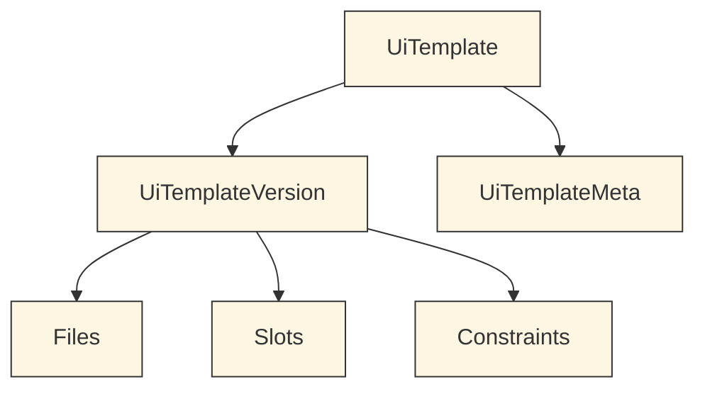
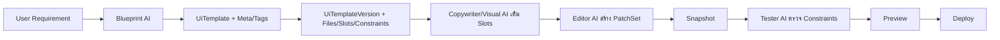

# 🗂️ คู่มือหัวคอลัมน์ของตาราง Template

ในตาราง Template (UiTemplate / UiTemplateVersion / Meta) เรามีคอลัมน์หลัก ๆ ที่ต้องเข้าใจ ทั้ง 4 มิติ:

1. **หน้าที่** (ทำอะไร)
2. **รูปแบบข้อมูล** (เก็บแบบไหน + ตัวอย่าง)
3. **ผู้ใช้งานหลัก** (ใครอ่าน/ใครเขียน)
4. **LEGO อธิบาย** (เปรียบเทียบกับการต่อ LEGO)

---

## `id`

1. **หน้าที่:** Primary key ของแต่ละแถว
2. **รูปแบบ:** String UUID เช่น `"8d90c3e2-..."`
3. **ผู้ใช้งาน:** Database/ระบบ ORM
4. **LEGO:** เลข Serial ชิ้น LEGO แต่ละกล่อง

---

## `key`

1. **หน้าที่:** รหัสอ้างอิง template เช่น `restaurant-vite-tailwind`
2. **รูปแบบ:** String (kebab-case), unique
3. **ผู้ใช้งาน:** Dev/Blueprint AI
4. **LEGO:** ชื่อรุ่นของชุด LEGO

---

## `label`

1. **หน้าที่:** ชื่อโชว์ใน UI เช่น `Restaurant Template`
2. **รูปแบบ:** String
3. **ผู้ใช้งาน:** User, Dev
4. **LEGO:** ป้ายชื่อบนหน้ากล่อง LEGO

---

## `category`

1. **หน้าที่:** กลุ่มเทมเพลต เช่น `landing`, `portfolio`, `restaurant`
2. **รูปแบบ:** Enum/String
3. **ผู้ใช้งาน:** Blueprint AI สำหรับ matching
4. **LEGO:** ชั้นวางในห้าง LEGO (หมวดบ้าน/รถ/ปราสาท)

---

## `meta`

1. **หน้าที่:** เก็บข้อมูลเสริม (description, engine, compat, tags)
2. **รูปแบบ:** JSON
   - ตัวอย่าง: `{ "engine": "vite", "tags": ["food","menu"] }`
3. **ผู้ใช้งาน:** Dev, AI (ใช้เลือก/validate)
4. **LEGO:** คู่มือบอกว่าในกล่องนี้มีอิฐกี่แบบ สีอะไร

---

## `files`

1. **หน้าที่:** รายชื่อไฟล์ในเทมเพลต
2. **รูปแบบ:** JSON Array
   - ตัวอย่าง: `[ { "path": "src/App.tsx", "kind": "code" } ]`
3. **ผู้ใช้งาน:** Editor AI, Orchestrator
4. **LEGO:** รายการชิ้นส่วนที่มีอยู่ในกล่อง

---

## `slots`

1. **หน้าที่:** จุดที่รอ AI/User เติมข้อมูล
2. **รูปแบบ:** JSON Schema
   - ตัวอย่าง: `{ "key":"hero.title", "type":"text", "required":true }`
3. **ผู้ใช้งาน:** Blueprint AI, Copywriter AI, Visual AI
4. **LEGO:** พื้นที่ว่างที่ป้ายกำกับว่า “ไว้แปะสติ๊กเกอร์ชื่อบ้าน”

---

## `constraints`

1. **หน้าที่:** กติกาคุณภาพ เช่น a11y/SEO/layout
2. **รูปแบบ:** JSON
   - ตัวอย่าง: `{ "a11y": { "contrast":"AA" } }`
3. **ผู้ใช้งาน:** Tester AI, Orchestrator
4. **LEGO:** คู่มือบอกว่า “บ้านนี้ต้องมีประตูเปิดได้ แสงเข้าถึง”

---

## `versions`

1. **หน้าที่:** เก็บประวัติ version ของ template
2. **รูปแบบ:** Relation → UiTemplateVersion[]
3. **ผู้ใช้งาน:** Dev, Orchestrator
4. **LEGO:** เวอร์ชันต่าง ๆ ของชุด LEGO (รุ่นเก่า รุ่นใหม่)

---

# ✅ สรุป

- `id/key/label/category` = ระบุว่ากล่องคืออะไร
- `meta/files/slots/constraints` = เนื้อหา + กติกาในกล่อง
- `versions` = ประวัติรุ่น
- **LEGO ภาพรวม**: Template = กล่อง LEGO, Slots = จุดว่าง, Constraints = กฎ, Files = ตัวต่อ, Meta = คู่มือ

---

# 📊 Mermaid Diagram (Column Relations)



**LEGO Mapping:**

- Template (T) = กล่อง LEGO
- Version (V) = รุ่นกล่อง
- Meta (M) = คู่มือรายละเอียด
- Files (F) = ชิ้นตัวต่อ
- Slots (S) = จุดว่างรอใส่สติ๊กเกอร์
- Constraints (C) = กฎการประกอบ

---

# 🧩 อธิบาย ERD

- **UiTemplate**: ศูนย์กลางของ template แต่ละ family (กล่องหลัก)
- **UiTemplateVersion**: รุ่นของ template ใช้จริง (เหมือน LEGO รุ่น 1, รุ่น 2)
- **UiTemplateMeta**: ข้อมูลอธิบาย/คำอธิบายเสริม (คู่มือประกอบกล่อง)
- **Tags**: ป้ายกำกับ ใช้จับคู่กับ requirement (เหมือนป้ายหมวดในร้าน LEGO)
- **Relation**: Template → Version → Files/Slots/Constraints, และ Template → Meta → Tags

---

# 🗂️ หน้าที่ของแต่ละตาราง

- **UiTemplate**: เก็บแม่แบบหลัก (id, key, label, category)
- **UiTemplateVersion**: เก็บรายละเอียดไฟล์, slots, constraints ของ template แต่ละเวอร์ชัน
- **UiTemplateMeta**: เก็บ metadata (description, engine, compat, author, tags)
- **Tag / UiTemplateMetaTag**: ระบบแท็กหลายต่อหลาย ช่วยให้ค้นหา/เลือก template ง่ายขึ้น

---

# ⚙️ Workflow การทำงาน (ตั้งแต่รับ requirement → ประกอบโค้ด)



**คำอธิบาย LEGO เวอร์ชัน:**

1. ผู้ใช้บอกความต้องการ = ลูกค้าบอกอยากได้บ้านแบบไหน
2. Blueprint AI เลือกกล่อง LEGO ที่เหมาะ (UiTemplate + Meta/Tags)
3. ใช้รุ่นของกล่อง (UiTemplateVersion) ที่มีชิ้นส่วน/กติกาพร้อม
4. AI เติมสติ๊กเกอร์/รูป/ข้อความลงในช่องว่าง (Slots)
5. Editor AI ประกอบและต่อชิ้นเพิ่ม (PatchSet)
6. ถ่ายรูปบ้านที่ประกอบเสร็จ (Snapshot)
7. Tester ตรวจว่าบ้านแข็งแรงตามกฎ (Constraints)
8. เอาบ้านไปวางโชว์ให้ดู (Preview)
9. ส่งบ้านไปวางในงานจริง (Deploy)

````


---

# 🚀 Workflow: จากรับ Requirement → ประกอบโค้ดเสร็จ
> มองภาพรวมตั้งแต่รับความต้องการจากผู้ใช้ จนกลายเป็นไฟล์โค้ดจริงในโปรเจกต์ พร้อม snapshot/preview

## 1) รับ Requirement
- **อินพุต:** คำอธิบายของผู้ใช้ (เป้าหมาย, ประเภทเว็บ, โทน, บล็อกที่ต้องมี)
- **ผู้รับผิดชอบ:** Blueprint AI
- **เอาต์พุต:** `RequirementSpec` (ข้อความสรุป + ตัวชี้วัดเบื้องต้น เช่น ประเภทธุรกิจ, CTA หลัก, โครงหน้า)
- **LEGO:** ลูกค้าบอกว่าอยากได้ “บ้าน 1 ชั้น มีสวน และระเบียง”

## 2) เลือก Template Family/Version
- **อินพุต:** RequirementSpec
- **ผู้รับผิดชอบ:** Blueprint AI
- **การทำงาน:** Match ด้วย `tags`, `category`, `meta.compat` → เลือก `UiTemplate` และ `UiTemplateVersion` ที่เหมาะสุด
- **เอาต์พุต:** `{ template.key, version }`
- **LEGO:** เลือก “กล่อง LEGO บ้านรุ่น 1.0” ที่ตรงกับสเปก

## 3) เติมค่า Slots (+ เลือกสไตล์จาก allowlist)
- **อินพุต:** Slots schema จาก `UiTemplateVersion.slots`
- **ผู้รับผิดชอบ:** Copywriter AI / Visual AI / Editor AI
- **การทำงาน:**
  - เติม content (เช่น `hero.title`, `menu.items`)
  - เลือก class จาก `style.allowlist` (ซิงก์กับ Tailwind safelist)
- **เอาต์พุต:** `SpecBundle` (ข้อมูลจริงสำหรับแต่ละ slot)
- **LEGO:** แปะสติ๊กเกอร์ชื่อบ้าน เลือกสีประตู/หน้าต่างจากชุดที่อนุญาต

## 4) สร้างแผน Orchestrator (Plan)
- **อินพุต:** `{ template.version, SpecBundle }`
- **ผู้รับผิดชอบ:** Orchestrator
- **การทำงาน:** แตกเป็นงานย่อย (DAG) เช่น `spec.validate → editor.apply → test.run → preview.build`
- **เอาต์พุต:** `OrchestratorPlan + OrchestratorTask[]`
- **LEGO:** วางลำดับการต่อ: โครง, ผนัง, หลังคา, ตรวจความแข็งแรง

## 5) Apply ด้วย Editor (PatchSet)
- **อินพุต:** Files manifest + SpecBundle + bindings/selectors
- **ผู้รับผิดชอบ:** Editor AI
- **การทำงาน:** สร้าง `PatchSet` (create/update ไฟล์ตาม whitelist path) แล้ว apply ลง `Project.File`
- **เอาต์พุต:** ชุดไฟล์จริงในโปรเจกต์ + `PatchSet` บันทึก diff
- **LEGO:** ต่อชิ้นส่วนตามคู่มือและจุดยึด (selectors)

## 6) สร้าง Snapshot
- **อินพุต:** สถานะไฟล์ปัจจุบันของโปรเจกต์
- **ผู้รับผิดชอบ:** Platform
- **การทำงาน:** บันทึก `Snapshot.files` (manifest+hash) เพื่อรองรับ rollback/reproducible build
- **เอาต์พุต:** `Snapshot`
- **LEGO:** ถ่ายรูปบ้านตอนต่อเสร็จ เพื่อจำลองใหม่ได้เหมือนเดิม

## 7) Tester Gates (ตาม constraints)
- **อินพุต:** `constraints` จาก Template Version + โค้ดจริง/Preview build
- **ผู้รับผิดชอบ:** Tester AI
- **การทำงาน:** รันทดสอบ `schema/tsc/eslint/a11y/build` (และอื่น ๆ ถ้ากำหนด)
- **เอาต์พุต:** รายงาน pass/fail + คำแนะนำแก้ไข
- **LEGO:** ตรวจว่าประตูเปิดได้ แสงเข้าได้ โครงไม่เอียง

## 8) Preview → Deploy
- **อินพุต:** Snapshot ที่ผ่านเกณฑ์
- **ผู้รับผิดชอบ:** Platform/Deploy
- **การทำงาน:** สร้าง `PreviewSession` ถ้าผ่านเกณฑ์จึงเปิดทาง Deploy (เช่น Vercel/Netlify)
- **เอาต์พุต:** URL preview/deploy
- **LEGO:** ยกบ้านไปตั้งโชว์ในตู้กระจก

---

## 🧭 Mermaid: End-to-End Workflow
```mermaid
flowchart TD
  A[User Requirement] --> B[Blueprint AI
select UiTemplate/Version]
  B --> C[Fill Slots
(content + style.allowlist)]
  C --> D[Orchestrator Plan
(DAG tasks)]
  D --> E[Editor AI
Apply PatchSet]
  E --> F[Snapshot]
  F --> G[Tester AI
constraints gates]
  G -- pass --> H[Preview]
  H --> I[Deploy]
  G -- fail --> E
````

**Mapping กับตาราง/คอลัมน์**

- เลือก template/version → `UiTemplate`, `UiTemplateVersion(status/compat/tags)`
- เติม slots → `UiTemplateVersion.slots` + `SpecBundle`
- Apply files → `UiTemplateVersion.files` → `File` + `PatchSet/Patch`
- Snapshot/Preview → `Snapshot`, `PreviewSession`
- Tester gates → อ่านจาก `constraints` และเขียนผลลง `TestSuite/TestRun`

